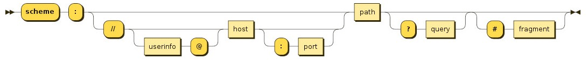
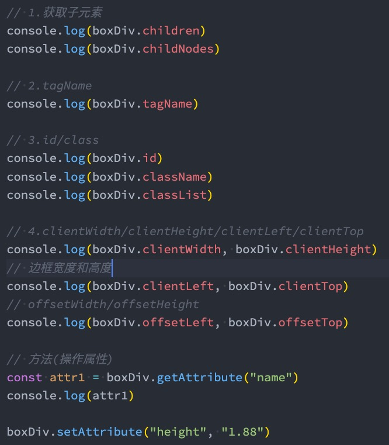

# BOM-DOM

## 一.  BOM

### 1.1 **认识BOM**

JavaScript有一个非常重要的运行环境就是浏览器，而且浏览器本身又作为一个应用程序需要对其本身进行操作，所以通常浏览器会有对应的对象模型（BOM，Browser Object Model）。 我们可以将BOM看成是连接JavaScript脚本与浏览器窗口的桥梁。 

BOM主要包括一下的对象模型： 

window：包括全局属性、方法，控制浏览器窗口相关的属性、方法

location：浏览器连接到的对象的位置（URL）

history：操作浏览器的历史

document：当前窗口操作文档的对象

window对象在浏览器中有两个身份

身份一：全局对象

我们知道ECMAScript其实是有一个全局对象的，这个全局对象在Node中是global，在浏览器中就是window对象

身份二：浏览器窗口对象

作为浏览器窗口时，提供了对浏览器操作的相关的API

### 1.2 **Window全局对象**

在浏览器中，window对象就是之前经常提到的全局对象，也就是我们之前提到过GO对象： 比如在全局通过var声明的变量，会被添加到GO中，也就是会被添加到window上 ，比如window默认给我们提供了全局的函数和类：setTimeout、Math、Date、Object等； 通过var声明的变量，全局提供的类和方法

### 1.3 **Window窗口对象**

事实上window对象上肩负的重担是非常大的： 

第一：包含大量的属性，localStorage、console、location、history、screenX、scrollX等等（大概60+个属性）

第二：包含大量的方法，alert、close、scrollTo、open等等（大概40+个方法） 

第三：包含大量的事件，focus、blur、load、hashchange等等（大概30+个事件）

第四：包含从EventTarget继承过来的方法，addEventListener、removeEventListener、dispatchEvent方法

那么这些大量的属性、方法、事件在哪里查看呢？ 

MDN文档：https://developer.mozilla.org/zh-CN/docs/Web/API/Window 

查看MDN文档时，我们会发现有很多不同的符号，这里我解释一下是什么意思： 

删除符号：表示这个API已经废弃，不推荐继续使用了

点踩符号：表示这个API不属于W3C规范，某些浏览器有实现（所以兼容性的问题）

实验符号：该API是实验性特性，以后可能会修改，并且存在兼容性问题

### 1.4 **EventTarget**

Window继承自EventTarget，所以会继承其中的属性和方法： 

addEventListener：注册某个事件类型以及事件处理函数

removeEventListener：移除某个事件类型以及事件处理函数

dispatchEvent：派发某个事件类型到EventTarget上

### 1.5 **Location对象常见的属性**

Location对象用于表示window上当前链接到的URL信息。 

常见的属性有哪些呢？ 

href: 当前window对应的超链接URL, 整个URL 

protocol: 当前的协议 

host: 主机地址 

hostname: 主机地址(不带端口) 

port: 端口

pathname: 路径 

search: 查询字符串

hash: 哈希值

username：URL中的username（很多浏览器已经禁用）

password：URL中的password（很多浏览器已经禁用）

### 1.6 **Location对象常见的方法**

我们会发现location其实是URL的一个抽象实现：

location有如下常用的方法： 

assign：赋值一个新的URL，并且跳转到该URL中

replace：打开一个新的URL，并且跳转到该URL中（不同的是不会在浏览记录中留下之前的记录）

reload：重新加载页面，可以传入一个Boolean类型

### 1.7 **history对象常见属性和方法**

history对象允许我们访问浏览器曾经的会话历史记录。 有两个属性： 

length：会话中的记录条数

state：当前保留的状态值 

有五个方法： 

back()：返回上一页，等价于history.go(-1)

forward()：前进下一页，等价于history.go(1) 

go()：加载历史中的某一页； 

pushState()：打开一个指定的地址

replaceState()：打开一个新的地址，并且使用replace

## 二、DOM

### 2.1 **认识DOM和架构**

浏览器是用来展示网页的，而网页中最重要的就是里面各种的标签元素，JavaScript很多时候是需要操作这些元素的。 

JavaScript如何操作元素呢？通过Document Object Model（DOM，文档对象模型）

DOM给我们提供了一系列的模型和对象，让我们可以方便的来操作Web页面

因为继承自EventTarget，所以也可以使用EventTarget的方法：

### 2.2 **Node节点**

所有的DOM节点类型都继承自Node接口。 

 https://developer.mozilla.org/zh-CN/docs/Web/API/Node 

**Node有几个非常重要的属性：** 

nodeName：node节点的名称 

nodeType：可以区分节点的类型 

nodeValue：node节点的值 

childNodes：所有的子节点

### 2.3 **Document**

Document节点表示的整个载入的网页，我们来看一下常见的属性和方法：

document.title

document.body

document.head

document.children

document.location

document.createElement('div')

document.body.appendChild(El)

document.body.removeChild(El)

document.getElementById('id')

document.getElementByName('name')

document.getElementByTagName('El')

document.querySelector('El')

document.querySelectorAll('El')

### 2.4 **Element**

平时创建的div、p、span等元素在DOM中表示为Element元素

## 三、**认识事件监听**

JavaScript脚本和浏览器之间交互时，浏览器给我们提供的BOM、DOM等一些对象模型。 事实上还有一种需要和浏览器经常交互的事情就是事件监听： 浏览器在某个时刻可能会发生一些事件，比如鼠标点击、移动、滚动、获取、失去焦点、输入内容等等一系列的事件 

我们需要以某种方式（代码）来对其进行响应，进行一些事件的处理； 在Web当中，事件在浏览器窗口中被触发，并且通过绑定到某些元素上或者浏览器窗口本身，那么我们就可以给这些元素或者window窗口来绑定事件的处理程序，来对事件进行监听。 

如何进行事件监听呢？ 

事件监听方式一：在script中直接监听

事件监听方式二：通过元素的on来监听事件

事件监听方式三：通过EventTarget中的addEventListener来监听

## 四、**认识事件流的由来**

事实上对于事件有一个概念叫做事件流，为什么会产生事件流呢？ 

我们可以想到一个问题：当我们在浏览器上对着一个元素点击时，你点击的不仅仅是这个元素本身，这是因为我们的HTML元素是存在父子元素叠加层级的； 比如一个span元素是放在div元素上的，div元素是放在body元素上的，body元素是放在html元素上的

## 五、**事件冒泡和事件捕获**

我们会发现默认情况下事件是从最内层的span向外依次传递的顺序，这个顺序我们称之为事件冒泡（Event  Bubble） 

事实上，还有另外一种监听事件流的方式就是从外层到内层（body -> span），这种称之为事件捕获（Event Capture）

为什么会产生两种不同的处理流呢？ 

这是因为早期浏览器开发时，不管是IE还是Netscape公司都发现了这个问题，但是他们采用了完全相反的事件流来对事件进行了传递； 

**IE采用了事件冒泡的方式，Netscape采用了事件捕获的方式**

那么我们如何去监听事件捕获的过程呢？

### 5.1 **冒泡和捕获的顺序**

如果我们同时有事件冒泡和时间捕获的监听，那么会**优先监听到事件捕获**的：

### 5.2 **事件对象event**

当一个事件发生时，就会有和这个事件相关的很多信息： 比如事件的类型是什么，你点击的是哪一个元素，点击的位置是哪里等等相关的信息，那么这些信息会被封装到一个Event对象中； 该对象给我们提供了想要的一些属性，以及可以通过该对象进行某些操作

常见的属性： 

type：事件的类型

target：当前事件发生的元素

currentTarget：当前处理事件的元素

offsetX、offsetY：点击元素的位置

常见的方法： 

preventDefault：取消事件的默认行为

stopPropagation：阻止事件的进一步传递

事件类型：https://developer.mozilla.org/zh-CN/docs/Web/Events