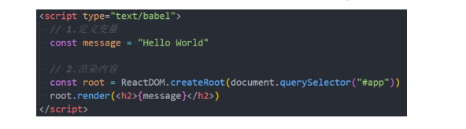

## 一. **React的开发依赖**

- **开发React必须依赖三个库：**
  - react：包含react所必须的核心代码
  - react-dom：react渲染在不同平台所需要的核心代码
  - babel：将jsx转换成React代码的工具
- **react依赖这么多库?**
  - 对于Vue来说，我们只是依赖一个vue.js文件即可，但是react居然要**依赖三个包**
  - 其实呢，这三个库是各司其职的，目的就是让每一个库只单纯做自己的事情
  - 在React的0.14版本之前是没有react-dom这个概念的，所有功能都包含在react里
- **为什么要进行拆分呢？原因就是react-native**
  - react包中包含了**react** **web**和**react-native**所共同拥有的核心代码
  - react-dom针对web和native所完成的事情不同
    - web端：react-dom会将jsx最终渲染成真实的DOM，显示在浏览器中
    - native端：react-dom会将jsx最终渲染成原生的控件（比如Android中的Button，iOS中的UIButton）

## 二. **Babel和React的关系**

- **babel是什么呢？**
  - **Babel** ，又名 **Babel.js**, 是目前前端使用非常广泛的**编译器**、**转移器**
  - 当下很多浏览器并不支持ES6的语法，但是确实ES6的语法非常的简洁和方便，我们**开发时**希望使用它
  - 那么编写源码时我们就可以使用ES6来编写，之后通过Babel工具，将ES6转成大多数浏览器都支持的ES5的语法
- **React和Babel的关系：**
  - 默认情况下开发React其实可以不使用babel
  - 但是前提是我们自己使用 **React.createElement** 来编写源代码，它编写的代码**非常的繁琐和可读性差**
  - 那么我们就可以直接编写**jsx（JavaScript XML）的语法**，并且让**babel帮助我们转换成React.createElement**

## 三. **React的依赖引入**

**我们在编写React代码时，这三个依赖都是必不可少的**

- 方式一：直接CDN引入
- 方式二：下载后，添加本地依赖
- 方式三：通过npm管理

这里有一个**crossorigin**的属性，这个属性的目的是为了拿到跨域脚本的错误信息

- 

  

  

## 四. 编写react

- **在界面上通过React显示一个Hello World**
  - 注意：这里我们编写React的script代码中，必须添加 type="text/babel"，作用是可以让babel解析jsx的语法

- **ReactDOM. createRoot函数：**用于创建一个React根，之后渲染的内容会包含在这个根中
  - 参数：将渲染的内容，挂载到哪一个HTML元素上
    - 这里我们提前定义一个id为app的div
- **root.render函数:**
  - 参数：要渲染的根组件
- **我们可以通过{}语法来引入外部的变量或者表达式**

## 五. **组件化开发**

- **整个逻辑其实可以看做一个整体，那么我们就可以将其封装成一个组件：**

  - r**oot.render 参数是一个HTML元素或者一个组件**
  - 我们可以先将之前的业务逻辑封装到一个组件中，然后传入到 ReactDOM.render 函数中的第一个参数

- **在React中，如何封装一个组件呢？**这里我们暂时使用类的方式封装组件：

  - 1. 定义一个类（类名大写，组件的名称是必须大写的，小写会被认为是HTML元素），继承自**React.Component**

    2.  实现当前组件的render函数

       render当中返回的jsx内容，就是之后React会帮助我们渲染的内容

  

## 六. **数据依赖**

- **组件化问题一：**数据在哪里定义？
  - **在组件中的数据，我们可以分成两类：**
    - 参与界面更新的数据：当数据变量时，需要更新组件渲染的内容
    - 不参与界面更新的数据：当数据变量时，不需要更新将组建渲染的内容
  - **参与界面更新的数据我们也可以称之为是**参与数据流，这个数据是定义在当前对象的**state**中
    - 可以通过在构造函数中 **this.state = {定义的数据}**
    - 当数据发生变化时，我们可以调用 **this.setState** 来更新数据，并且通知React进行update操作
    - 在进行update操作时，就会**重新调用render函数**，并且使用最新的数据，来渲染界面

## 七. **事件绑定**

- **组件化问题二：事件绑定中的this**
  - 在类中直接定义一个函数，并且将这个函数绑定到元素的onClick事件上，当前这个函数的this指向的是谁呢？
- **默认情况下是undefined**
  - 在正常的DOM操作中，监听点击，监听函数中的this其实是节点对象（比如说是button对象）
  - 因为React并不是直接渲染成真实的DOM，我们所编写的button只是一个语法糖，它的本质React的Element对象
  - 那么在这里发生监听的时候，**react在执行函数时并没有绑定this，默认情况下就是一个undefined**
- **我们在绑定的函数中，可能想要使用当前对象，比如执行 this.setState 函数，就必须拿到当前对象的this**
  - 就需要在传入函数时，给这个函数直接绑定this
  - 类似于下面的写法： <button onClick={this.changeText.bind(this)}>改变文本</button>

.png)

.png)