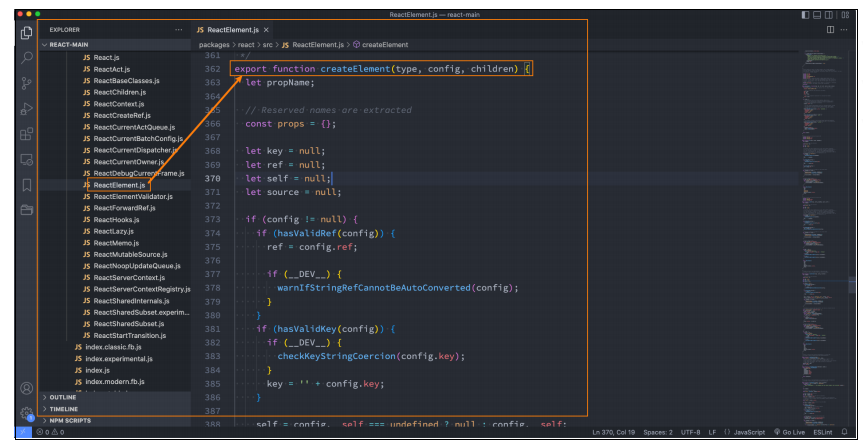

## 一. **JSX的本质**

- **实际上，jsx 仅仅只是 React.createElement(component, props, ...children) 函数的语法糖。**
  - 所有的jsx最终都会被转换成**React.createElement**的函数调用
- **createElement需要传递三个参数：**
  - 参数一：type
    - 当前ReactElement的类型
    - 如果是标签元素，那么就使用字符串表示 “div”
    - 如果是组件元素，那么就直接使用组件的名称
  - 参数二：config
    - 所有jsx中的属性都在config中以对象的属性和值的形式存储
    - 比如传入className作为元素的class
  - 参数三：children
    - 存放在标签中的内容，以children数组的方式进行存储

## 二. **createElement源码**

## 三. **jsx和原生对比**

### 3.1 **Babel官网查看**

- **我们知道默认jsx是通过babel帮我们进行语法转换的，所以我们之前写的jsx代码都需要依赖babel**
- **可以在babel的官网中快速查看转换的过程：****https://babeljs.io/repl/#?presets=react**

### 3.2 **直接编写jsx代码**

-  **我们自己来编写React.createElement代码**

- 我们就没有通过jsx来书写了，界面依然是可以正常的渲染

  - 另外，在这样的情况下 type="text/babel"可以被我们删除掉了

  

### 3.3 **虚拟DOM的创建过程**

- **我们通过 React.createElement 最终创建出来一个 ReactElement对象**
- **这个ReactElement对象是什么作用呢？React为什么要创建它呢？**
  - 原因是React利用ReactElement对象组成了一个JavaScript的对象树
  - JavaScript的对象树就是虚拟DOM（Virtual DOM）
-  **而ReactElement最终形成的树结构就是Virtual DOM**

### 3.4 **jsx – 虚拟DOM – 真实DOM**

### 3.5 **声明式编程**

- **虚拟DOM帮助我们从命令式编程转到了声明式编程的模式**
- **React官方的说法：**Virtual DOM 是一种编程理念
  -  在这个理念中，UI以一种理想化或者说虚拟化的方式保存在内存中，并且它是一个相对简单的JavaScript对象
  - 我们可以通过ReactDOM.createRoot(ReactDOM.render)让 虚拟DOM 和 真实DOM同步起来，这个过程中叫做协调（Reconciliation）
- 这种编程的方式赋予了React声明式的API：
  - 你只需要告诉React希望让UI是什么状态
  - React来确保DOM和这些状态是匹配的
  - 你不需要直接进行DOM操作，就可以从手动更改DOM、属性操作、事件处理中解放出来