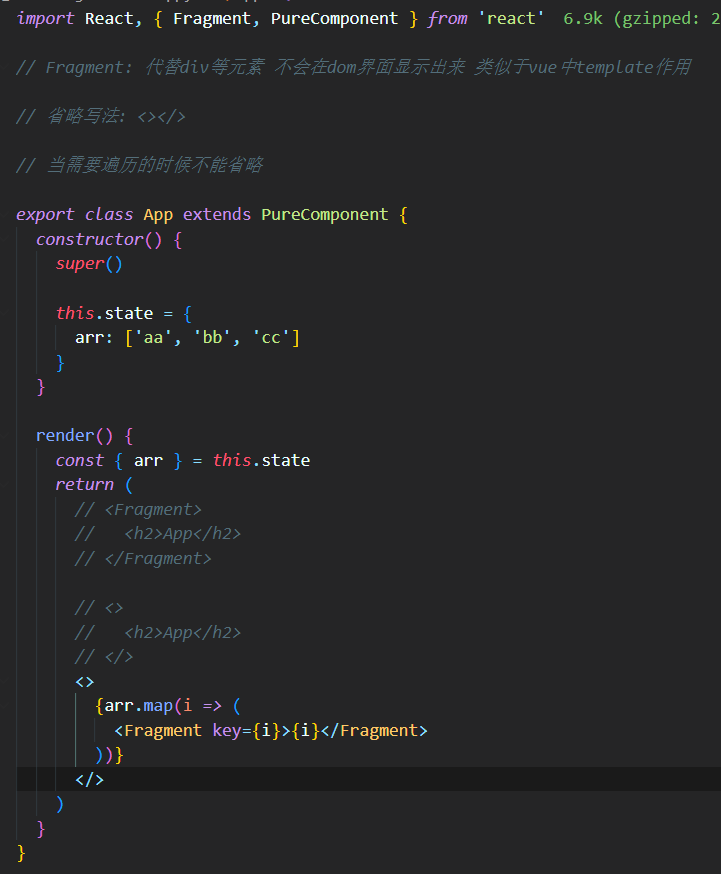

## 一. **React更新机制**

- **React的渲染流程：**

- **React的更新流程**

## 二. **React的更新流程**

- **React在props或state发生改变时，会调用React的render方法，会创建一颗不同的树**
- **React需要基于这两颗不同的树之间的差别来判断如何有效的更新UI：**
  - 如果一棵树参考另外一棵树进行完全比较更新，那么即使是最先进的算法，该算法的复杂程度为 O(n^2)，其中 n 是树中元素的数量
  - https://grfia.dlsi.ua.es/ml/algorithms/references/editsurvey_bille.pdf
  - 如果在 React 中使用了该算法，那么展示 1000 个元素所需要执行的计算量将在十亿的量级范围
  - 这个开销太过昂贵了，React的更新性能会变得非常低效
- **于是，React对这个算法进行了优化，将其优化成了O(n)，如何优化的呢？**
  - 同层节点之间相互比较，不会垮节点比较
  - 不同类型的节点，产生不同的树结构
  - 开发中，可以通过key来指定哪些节点在不同的渲染下保持稳定

## 三. **keys的优化**

- 在遍历列表时，总是会提示一个警告，让我们加入一个key属性：
- 方式一：在最后位置插入数据
  - 这种情况，有无key意义并不大
- 方式二：在前面插入数据
  - 这种做法，在没有key的情况下，所有的li都需要进行修改
- 当子元素(这里的li)拥有 key 时，React 使用 key 来匹配原有树上的子元素以及最新树上的子元素
  - 在下面这种场景下，key为111和222的元素仅仅进行位移，不需要进行任何的修改
  - 将key为333的元素插入到最前面的位置即可
- key的注意事项：
  - key应该是唯一的
  - key不要使用随机数（随机数在下一次render时，会重新生成一个数字）
  - 使用index作为key，对性能是没有优化的

## 四. **render函数被调用**

- **嵌套案例**
  - 在App中，我们增加了一个计数器的代码
  - 当点击+1时，会重新调用App的render函数
  - 而当App的render函数被调用时，所有的子组件的render函数都会被重新调用

- **我们可以思考一下，在以后的开发中，我们只要是修改了App中的数据，所有的组件都需要重新render，进行diff算法性能必然是很低的**
  - 事实上，很多的组件没有必须要重新render
  - 它们调用render应该有一个前提，就是依赖的数据（state、props）发生改变时，再调用自己的render方法
- **如何来控制render方法是否被调用呢？**
  - 通过**shouldComponentUpdate**方法即可

## 五. **shouldComponentUpdate**

- **React给我们提供了一个生命周期方法 shouldComponentUpdate（很多时候，我们简称为SCU），这个方法接受参数，并且需要有返回值**

- **该方法有三个参数：**

  - 参数一：**nextProps** 组件即将用来渲染的下一个 props 。 将**nextProps**  与**this.props**进行比较以确定发生了什么变化

  - 参数二：**nextState** 组件即将渲染的下一个 state。将 **nextState** 与 **this.state** 进行比较以确定发生了什么变化

  - 参数三:  **nextConetxt** 组件将要渲染的下一个 context。将 **nextConetxt** 与 **this.context** 进行比较以确定发生了什么变化 

    仅当你指定了 static contextType（更新的）或 static contextType（旧版）时才可用

- **该方法返回值是一个boolean类型：**

  - 返回值为true，那么就需要调用render方法
  - 返回值为false，那么就不需要调用render方法
  - 默认返回的是true，也就是只要state发生改变，就会调用render方法

- **比如我们在App中增加一个message属性：**

  - sx中并没有依赖这个message，那么它的改变不应该引起重新渲染
  - 但是因为render监听到state的改变，就会重新render，所以最后render方法还是被重新调用了

## 六. **PureComponent**

- **如果所有的类，我们都需要手动来实现 shouldComponentUpdate，那么会给我们开发者增加非常多的工作量**
  - 我们来设想一下shouldComponentUpdate中的各种判断的目的是什么？
  - props或者state中的数据是否发生了改变，来决定shouldComponentUpdate返回true或者false
- **React已经考虑到了这一点，所以React已经默认帮我们实现好了**
  - 将class继承自PureComponent

## 七. **shallowEqual方法**

- **这个方法中，调用 !shallowEqual(oldProps, newProps) || !shallowEqual(oldState, newState)，这个shallowEqual就是进行浅层比较：**

## 八. **高阶组件memo**

- **目前我们是针对类组件可以使用PureComponent，那么函数式组件呢？**
  - 事实上函数式组件我们在props没有改变时，也是不希望其重新渲染其DOM树结构的
- **我们需要使用一个高阶组件memo：**
  - 我们将之前的Header、Banner、ProductList都通过memo函数进行一层包裹
  - Footer没有使用memo函数进行包裹
  - 最终的效果是，当counter发生改变时，Header、Banner、ProductList的函数不会重新执行
  - 而Footer的函数会被重新执行

## 九. **不可变数据的力量**

- 当state中数据为引用类型(Array/Object)时 通过this.setState修改内容时 先对数据进行浅拷贝, 否则页面不会响应
  - **调试**
    - 如果你使用 `console.log` 并且不直接修改 state，你之前日志中的 state 的值就不会被新的 state 变化所影响。这样你就可以清楚地看到两次渲染之间 state 的值发生了什么变化
  - **优化**
    - React 常见的 [优化策略](https://zh-hans.react.dev/reference/react/memo) 依赖于如果之前的 props 或者 state 的值和下一次相同就跳过渲染。如果你从未直接修改 state ，那么你就可以很快看到 state 是否发生了变化。如果 `prevObj === obj`，那么你就可以肯定这个对象内部并没有发生改变
  - 在实践中，你经常可以 “侥幸” 直接修改 state 而不出现什么问题，但是我们强烈建议你不要这样做

## 十. **使用ref**

### 10.1 **如何使用ref**

- **在React的开发模式中，通常情况下不需要、也不建议直接操作DOM原生，但是某些特殊的情况，确实需要获取到DOM进行某些操作：**
  - 管理焦点，文本选择或媒体播放
  - 触发强制动画
  - 集成第三方 DOM 库
  - 我们可以通过refs获取DOM
- **如何创建refs来获取对应的DOM呢？目前有三种方式：**
  - 方式一：传入字符串
    - 使用时通过 this.refs.传入的字符串格式获取对应的元素
  - 方式二：传入一个对象  (**常用**)
    - 对象是通过 **React.createRef()** 方式创建出来的
    - 使用时获取到创建的对象其中有一个current属性就是对应的元素
  - 方式三：传入一个函数
    - 该函数会在DOM被挂载时进行回调，这个函数会传入一个 元素对象，我们可以自己保存
    - 使用时，直接拿到之前保存的元素对象即可

### 10.2 **ref的类型**

- **ref 的值根据节点的类型而有所不同：**
  - 当 ref 属性用于 HTML 元素时，构造函数中使用 React.createRef() 创建的 ref 接收底层 DOM 元素作为其 current 属性
  - 当 ref 属性用于自定义 class 组件时，ref 对象接收组件的挂载实例作为其 current 属性
  - **不能在函数组件上使用 ref 属性**，因为他们没有实例
- **函数式组件是没有实例的，所以无法通过ref获取他们的实例：**
  - 可以通过 **React.forwardRef**获取函数式组件中的某个DOM元素

## 十一. **受控组件**

### 11.1 **认识受控组件**

- **在React中，HTML表单的处理方式和普通的DOM元素不太一样：表单元素通常会保存在一些内部的state**
- **比如下面的HTML表单元素：**
  - 这个处理方式是DOM默认处理HTML表单的行为，在用户点击提交时会提交到某个服务器中，并且刷新页面
  - 在React中，并没有禁止这个行为，它依然是有效的
  - 但是通常情况下会使用JavaScript函数来方便的处理表单提交，同时还可以访问用户填写的表单数据
  - 实现这种效果的标准方式是使用“**受控组件**”

### 11.2 **受控组件基本演练**

- **在 HTML 中，表单元素（如<input>、 <textarea> 和 <select>）之类的表单元素通常自己维护 state，并根据用户输入进行更新**
- **而在 React 中，可变状态（mutable state）通常保存在组件的state 属性中，并且只能通过使用 setState()来更新**
  - 我们将两者结合起来，使React的state成为“唯一数据源”
  - 渲染表单的 React 组件还控制着用户输入过程中表单发生的操作
  - **被 React 以这种方式控制取值的表单输入元素就叫做“受控组件”**
- **由于在表单元素上设置了 value 属性，因此显示的值将始终为 this.state.value，这使得 React 的 state 成为唯一数据源**

### 11.3 **其他的受控组件**

- **textarea标签**
  - texteare标签和input比较相似
- **select标签**
  - select标签需要通过selected属性来控制哪一个被选中，它可以匹配state的value来选中
- **处理多个输入**
  - 多处理方式可以像单处理方式那样进行操作，但是需要多个监听方法：
  - 可以使用ES6的一个语法：计算属性名（Computed property names）

### 11.4 代码案例

## 十二. **高阶组件**

### 12.1 **认识高阶组件**

- **高阶组件和高阶函数非常相似**
- **高阶函数的维基百科定义：至少满足以下条件之一：**
  - 接受一个或多个函数作为输入
  - 输出一个函数
- **avaScript中比较常见的filter、map、reduce都是高阶函数**
- **什么是高阶组件**
  - 高阶组件的英文是 **Higher-Order Components**，简称为 HOC
  - 官方的定义：**高阶组件是参数为组件，返回值为新组件的函数**
- **我们可以进行如下的解析：**
  - 首先， **高阶组件本身不是一个组件，而是一个函数**
  - 其次，**这个函数的参数是一个组件，返回值也是一个组件**

### 12.2 **高阶组件的定义**

- **高阶函数的编写过程类似于这样：**

- **高阶组件并不是React API的一部分，它是基于React的组合特性而形成的设计模式**
- **高阶组件在一些React第三方库中非常常见：**
  - 比如redux中的connect
  - 比如react-router中的withRouter
- **组件的名称问题：**
  - 在ES6中，类表达式中类名是可以省略的

### 12.3 **高阶组件的应用**

- **props的增强**
  - **不修改原有代码的情况下，添加新的props**

.png)

.png)

- **渲染判断鉴权**
  - **在开发中，我们可能遇到这样的场景：**
    - 某些页面是必须用户登录成功才能进行进入
    - 如果用户没有登录成功，那么直接跳转到登录页面
  - **这个时候，我们就可以使用高阶组件来完成鉴权操作：**

.png)

.png)

- **生命周期劫持**
  - **我们也可以利用高阶函数来劫持生命周期，在生命周期中完成自己的逻辑：**

### 12.4 **高阶函数的意义**

- **利用高阶组件可以针对某些React代码进行更加优雅的处理**
- **其实早期的React有提供组件之间的一种复用方式是mixin，目前已经不再建议使用：**
  - Mixin 可能会相互依赖，相互耦合，不利于代码维护
  - 不同的Mixin中的方法可能会相互冲突
  - Mixin非常多时，组件处理起来会比较麻烦，甚至还要为其做相关处理，这样会给代码造成滚雪球式的复杂性
- **当然，HOC也有自己的一些缺陷：**
  - HOC需要在原组件上进行包裹或者嵌套，如果大量使用HOC，将会产生非常多的嵌套，这让调试变得非常困难
  - HOC可以劫持props，在不遵守约定的情况下也可能造成冲突
- **Hooks的出现，是开创性的，它解决了很多React之前的存在的问题**
  - 比如this指向问题、比如hoc的嵌套复杂度问题等等

## 十三. **Portals的使用**

- **某些情况下，我们希望渲染的内容独立于父组件，甚至是独立于当前挂载到的DOM元素中（默认都是挂载到id为root的DOM元素上的）**
- **Portal 提供了一种将子节点渲染到存在于父组件以外的 DOM 节点的优秀的方案：**
  - 第一个参数（child）是任何可渲染的 React 子元素，例如一个元素，字符串或 fragment
  - 第二个参数（container）是一个 DOM 元素

## 十四. **fragment**

- **在之前的开发中，我们总是在一个组件中返回内容时包裹一个div元素：**
- **我们又希望可以不渲染这样一个div应该如何操作呢？**
  - 使用Fragment
  - Fragment 允许你将子列表分组，而无需向 DOM 添加额外节点
- **React还提供了Fragment的短语法：**
  - 它看起来像空标签 <> </>
  - 但是，如果我们需要在Fragment中添加key，那么就不能使用短语法

## 十五. **StrictMode**

- **StrictMode 是一个用来突出显示应用程序中潜在问题的工具：**
  - 与 Fragment 一样，StrictMode 不会渲染任何可见的 UI
  - 它为其后代元素触发额外的检查和警告
  - 严格模式检查仅在开发模式下运行；*它们不会影响生产构建*
- **可以为应用程序的任何部分启用严格模式：**
- **严格模式检查的是什么？**
  - 1.识别不安全的生命周期：
  - 2.使用过时的ref API
  - 3.检查意外的副作用
    - 这个组件的constructor会被调用两次
    - 这是严格模式下故意进行的操作，让你来查看在这里写的一些逻辑代码被调用多次时，是否会产生一些副作用
    - 在生产环境中，是不会被调用两次的
  - 4.使用废弃的findDOMNode方法
    - 在之前的React API中，可以通过findDOMNode来获取DOM，不过已经不推荐使用了
  - 5.检测过时的context API
    - 早期的Context是通过static属性声明Context对象属性，通过getChildContext返回Context对象等方式来使用Context的
    - 目前这种方式已经不推荐使用

