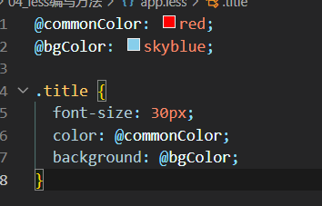
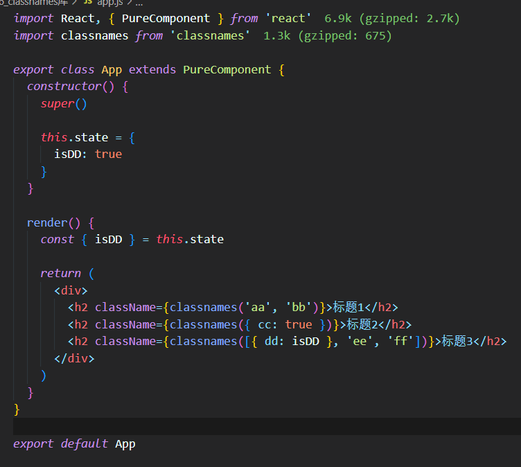
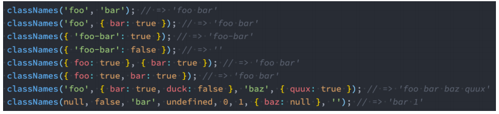

## 一. **组件化天下的CSS**

- **整个前端已经是组件化的天下：**
  - 而CSS的设计就不是为组件化而生的，所以在目前组件化的框架中都在需要一种合适的CSS解决方案
- **在组件化中选择合适的CSS解决方案应该符合以下条件：**
  - 可以编写局部css：css具备自己的具备作用域，不会随意污染其他组件内的元素
  - 可以编写动态的css：可以获取当前组件的一些状态，根据状态的变化生成不同的css样式
  - 支持所有的css特性：伪类、动画、媒体查询等
  - 编写起来简洁方便、最好符合一贯的css风格特点
  - 等等...

## 二. **React中的CSS**

- **css一直是React的痛点，也是被很多开发者吐槽、诟病的一个点**
- **在这一点上，Vue做的要好于React：**
  - Vue通过在.vue文件中编写 <style><style> 标签来编写自己的样式
  - 通过是否添加 scoped 属性来决定编写的样式是全局有效还是局部有效
  - 通过 lang 属性来设置你喜欢的 less、sass等预处理器
  - 通过内联样式风格的方式来根据最新状态设置和改变css
  - 等等...
- **Vue在CSS上虽然不能称之为完美，但是已经足够简洁、自然、方便了，至少统一的样式风格不会出现多个开发人员、多个项目采用不一样的样式风格**
- **相比而言，React官方并没有给出在React中统一的样式风格：**
  - 由此，从普通的css，到css modules，再到css in js，有几十种不同的解决方案，上百个不同的库
  - 大家一致在寻找最好的或者说最适合自己的CSS方案，但是到目前为止也没有统一的方案

## 三. **内联样式**

- **内联样式是官方推荐的一种css样式的写法：**
  - style 接受一个采用小驼峰命名属性的 JavaScript 对象，，而不是 CSS 字符串
  - 并且可以引用state中的状态来设置相关的样式
- **内联样式的优点:**
  - 1.内联样式, 样式之间不会有冲突
  - 2.可以动态获取当前state中的状态
- **内联样式的缺点：**
  - 1.写法上都需要使用驼峰标识
  - 2.某些样式没有提示
  - 3.大量的样式, 代码混乱
  - 4.某些样式无法编写(比如伪类/伪元素)
- **官方依然是希望内联合适和普通的css来结合编写**


## 四. **普通的css**

- **普通的css我们通常会编写到一个单独的文件，之后再进行引入**
- **这样的编写方式和普通的网页开发中编写方式是一致的：**
  - 如果我们按照普通的网页标准去编写，那么也不会有太大的问题
  - 但是组件化开发中我们总是希望组件是一个独立的模块，即便是样式也只是在自己内部生效，不会相互影响
  - 但是普通的css都属于全局的css，样式之间会相互影响
- **这种编写方式最大的问题是样式之间会相互层叠掉**

## 五. **css modules**

- **css modules并不是React特有的解决方案，而是所有使用了类似于webpack配置的环境下都可以使用的**
  - 如果在其他项目中使用它，那么我们需要自己来进行配置，比如配置webpack.config.js中的modules: true等
- **React的脚手架已经内置了css modules的配置：**
  - .css/.less/.scss 等样式文件都需要修改成 .module.css/.module.less/.module.scss 等
  - 之后就可以引用并且进行使用了
- **css modules确实解决了局部作用域的问题，也是很多人喜欢在React中使用的一种方案**
- **但是这种方案也有自己的缺陷：**
  - 引用的类名，不能使用连接符(.home-title)，在JavaScript中是不识别的
  - 所有的className都必须使用{style.className} 的形式来编写
  - 不方便动态来修改某些样式，依然需要使用内联样式的方式


## 六. **CSS in JS**

- **官方文档也有提到过CSS in JS这种方案：**

  - "CSS-in-JS” 是指一种模式，其中 CSS 由 JavaScript 生成而不是在外部文件中定义
  - 注意此功能并不是 React 的一部分，而是由第三方库提供
  - React 对样式如何定义并没有明确态度

- **在传统的前端开发中，我们通常会将结构（HTML）、样式（CSS）、逻辑（JavaScript）进行分离**

  - React的思想中认为**逻辑本身和UI是无法分离的**，所以才会有了JSX的语法
  - 样式也是属于UI的一部分
  - 事实上CSS-in-JS的模式就是一种**将样式（CSS）也写入到JavaScript中**的方式，并且可以方便的使用JavaScript的状态
  - 所以React有被人称之为 **All in JS**

- **当然，这种开发的方式也受到了很多的批评：**

  -  Stop using CSS in JavaScript for web development
  - https://hackernoon.com/stop-using-css-in-javascript-for-web-development-fa32fb873dcc

- **批评声音虽然有，但是在我们看来很多优秀的CSS-in-JS的库依然非常强大、方便：**

  - CSS-in-JS通过JavaScript来为CSS赋予一些能力，包括类似于CSS预处理器一样的样式嵌套、函数定义、逻辑复用、动态修改状态等等
  - 虽然CSS预处理器也具备某些能力，但是获取动态状态依然是一个不好处理的点
  - 所以，目前可以说CSS-in-JS是React编写CSS最为受欢迎的一种解决方案

- **目前比较流行的CSS-in-JS的库有哪些呢？**

  - styled-components
  - emotion
  - glamorous

- **目前可以说styled-components依然是社区最流行的CSS-in-JS库**

- **安装styled-components：**

  - ```shell
    npm install styled-components
    yarn add styled-components
    ```

- **ES6标签模板字符串**

  - **ES6中增加了模板字符串的语法，这个对于很多人来说都会使用**

  - **但是模板字符串还有另外一种用法：标签模板字符串（Tagged TemplateLiterals）**

    ```js
    function foo(...args){
      console.log(args)
    }
    const name = 'bob'
    foo`hello, world${name}`      // [hello, world, ''], bob
    ```

  - **如果我们在调用的时候插入其他的变量：**

    - 模板字符串被拆分了
    - 第一个元素是数组，是被模块字符串拆分的字符串组合
    - 后面的元素是一个个模块字符串传入的内容

  - **在styled component中，就是通过这种方式来解析模块字符串，最终生成我们想要的样式**

- **styled-components的本质是通过函数的调用，最终创建出一个组件**

  - 这个组件会被自动添加上一个不重复的class
  - styled-components会给该class添加相关的样式

- **另外，它支持类似于CSS预处理器一样的样式嵌套：**

  - 支持直接子代选择器或后代选择器，并且直接编写样式
  - 可以通过&符号获取当前元素
  - 直接伪类选择器、伪元素等

- **props、attrs属性**

  - **props可以被传递给styled组件**
    - 获取props需要通过${}传入一个插值函数，props会作为该函数的参数
    - 这种方式可以有效的解决动态样式的问题
  - **添加attrs属性**

- **styled高级特性**

  - **支持样式的继承**


.png)

.png)

.png)

## 六. react中使用less

- **craco.config.js配置**

  - 1. 安装 craco

       ```shell
       yarn add @craco/craco
       or
       npm i @craco/craco
       ```

  - 2. 安装 craco-less

       ```shell
       yarn add  craco-less
       or
       npm i  craco-less
       ```

  - 3. 修改package.json文件

       修改前

       ```shell
       "scripts": {
           "start": "react-scripts start",
           "build": "react-scripts build",
           "test": "react-scripts test",
           "eject": "react-scripts eject"
         },
       ```

       修改后

       ```shell
       "scripts": {
           "start": "craco start",
           "build": "craco build",
           "test": "craco test",
           "eject": "react-scripts eject"
         },
       ```

  - 4. 配置craco.config.js文件

       在package.json同济目录下创建craco.config.js文件

       ```shell
       const CracoLessPlugin = require('craco-less')
       
       module.exports = {
         plugins: [
           {
             plugin: CracoLessPlugin,
             options: {
               lessLoaderOptions: {
                 lessOptions: {
                   modifyVars: { '@primary-color': '#1DA57A' },
                   javascriptEnabled: true
                 }
               }
             }
           }
         ]
       }
       ```



## 七. **React中添加class**

- **React在JSX给了我们开发者足够多的灵活性，你可以像编写JavaScript代码一样，通过一些逻辑来决定是否添加某些class：**


- **这个时候我们可以借助于一个第三方的库：classnames**
  - 很明显，这是一个用于动态添加classnames的一个库



