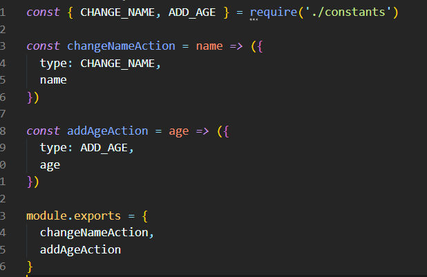
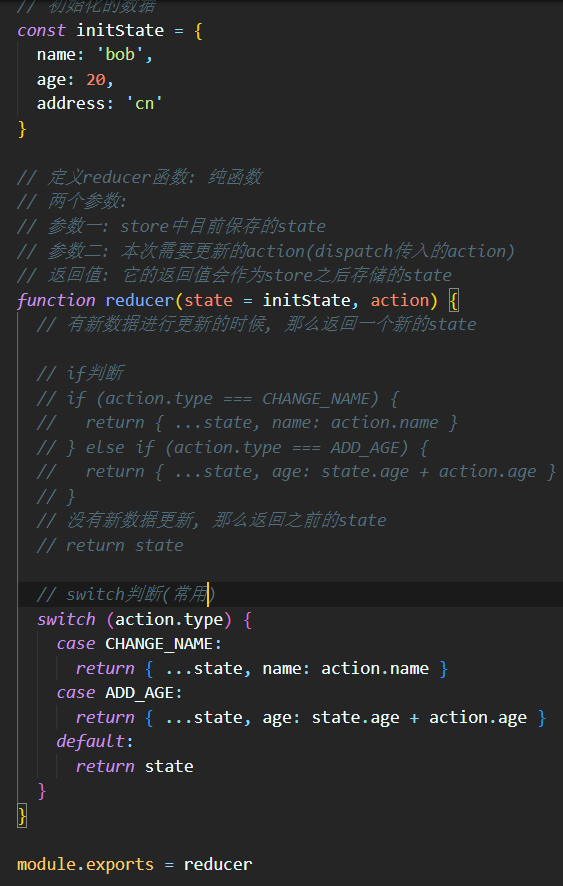

## 一. **为什么需要Redux**

- **JavaScript开发的应用程序，已经变得越来越复杂了：**

  - JavaScript需要管理的状态越来越多，越来越复杂
  - 这些状态包括服务器返回的数据、缓存数据、用户操作产生的数据等等，也包括一些UI的状态，比如某些元素是否被选中，是否显示加载动效，当前分页

- **管理不断变化的state是非常困难的：**

  - 状态之间相互会存在依赖，一个状态的变化会引起另一个状态的变化，View页面也有可能会引起状态的变化
  - 当应用程序复杂时，state在什么时候，因为什么原因而发生了变化，发生了怎么样的变化，会变得非常难以控制和追踪

- **React是在视图层帮助我们解决了DOM的渲染过程，但是State依然是留给我们自己来管理**

  - 无论是组件定义自己的state，还是组件之间的通信通过props进行传递；也包括通过Context进行数据之间的共享

  - React主要负责帮助我们管理视图，state如何维护最终还是我们自己来决定

    ```js
    UI = render(state)
    ```

- **Redux就是一个帮助我们管理State的容器：Redux是JavaScript的状态容器，提供了可预测的状态管理**

- **Redux除了和React一起使用之外，它也可以和其他界面库一起来使用（比如Vue），并且它非常小（包括依赖在内，只有2kb）**


## 二. **Redux测试项目搭建**

-  **安装redux：**

  - ```shell
    npm install redux
    # 或
    yanr add redux
    ```

- **1. 创建一个新的项目文件夹：learn-redux**

  - ```shell
    # 执行初始化操作
    npm init -y
    # 或
    yarn init
    ```

- **2. 创建src目录，并且创建index.js文件**

- **3. 修改package.json可以执行index.js**

  - ```shell
    "scripts": {
    	"start": "node src/index.js"
    }
    ```


## 三. Redux的使用过程

- **1.  创建一个对象，作为我们要保存的状态：**
- **2. 创建Store来存储这个state**
  - 创建store时必须创建reducer
  - 我们可以通过 store.getState 来获取当前的state
- **3. 通过action来修改state**
  - 通过dispatch来派发action
  - 通常action中都会有type属性，也可以携带其他的数据
- **4. 修改reducer中的处理代码**
  - reducer是一个纯函数，不需要直接修改state
- **5. 可以在派发action之前，监听store的变化**


## 四. **Redux的核心理念 - Store**

- **比如我们有一些数据需要管理：**
  - 如果我们没有定义统一的规范来操作这段数据，那么整个数据的变化就是无法跟踪的
  - 比如页面的某处增加了一条数据
  - 比如另一个页面修改了一条数据
- **整个应用程序错综复杂，当出现bug时，很难跟踪到底哪里发生的变化**


## 五. **Redux的核心理念 - action**

- **Redux要求我们通过action来更新数据：**
  - 所有数据的变化，必须通过派发（dispatch）action来更新
  - **action是一个普通的JavaScript对象，用来描述这次更新的type和content**
- **强制使用action的好处是可以清晰的知道数据到底发生了什么样的变化，所有的数据变化都是可跟追、可预测的**
  - **action是一个对象, 在真实的应用中, 我们会通过函数来定义, 返回一个action**



## 六. **Redux的核心理念 - reducer**

- **如何将state和action联系在一起呢？答案就是reducer**
  - reducer是一个**纯函数**
  - reducer做的事情就是将传入的**state和action结合起来生成一个新的state**



## 七. Redux未拆分写法

.png)

.png)

## 八. **Redux的三大原则**

- **单一数据源**
  - 整个应用程序的**state被存储在一颗object tree中，并且这个object tree只存储在一个 store 中**：
  - Redux并没有强制让我们不能创建多个Store，但是那样做并不利于数据的维护
  - 单一的数据源可以让整个应用程序的state变得方便维护、追踪、修改
- **State是只读的**
  - **唯一修改State的方法一定是触发action**，不要试图在其他地方通过任何的方式来修改State：
  - 这样就确保了View或网络请求都不能直接修改state，它们只能通过action来描述自己想要如何修改state
  - 这样可以保证所有的修改都被集中化处理，并且按照严格的顺序来执行，所以不需要担心race condition（竟态）的问题
- **使用纯函数来执行修改**
  - **通过reducer将 旧state和 actions联系在一起，并且返回一个新的State**：
  - 随着应用程序的复杂度增加，我们可以将reducer拆分成多个小的reducers，分别操作不同state tree的一部分
  - 但是所有的reducer都应该是纯函数，不能产生任何的副作用


## 九. **Redux结构划分**

- **如果我们将所有的逻辑代码写到一起，那么当redux变得复杂时代码就难以维护**
  - 对代码进行拆分，将store、reducer、action、constants拆分成一个个文件
  - 创建**store/index.js**文件
  - 创建**store/reducer.js**文件
  - 创建**store/actionCreators.js**文件
  - 创建**store/constants.js**文件
- **注意：node中对ES6模块化的支持**
  - 从node v13.2.0开始，node才对ES6模块化提供了支持
  - node v13.2.0之前，需要进行如下操作：
    - 在package.json中添加属性： "type": "module"
    - 在执行命令中添加如下选项：node --experimental-modules src/index.js
  - node v13.2.0之后，只需要进行如下操作
    - 在package.json中添加属性： "type": "module"
- **注意：导入文件时，需要跟上.js后缀名**


## 十. **Redux使用流程**

- **我们已经知道了redux的基本使用过程，那么我们就更加清晰来认识一下redux在实际开发中的流程：**


## 十一. **Redux官方图**


## 十二. **redux融入react代码**

- **目前redux在react中使用是最多的，所以我们需要将之前编写的redux代码，融入到react当中去**
- **这里我创建了两个组件：**
  - Home组件：其中会展示当前的counter值，并且有一个+1和+5的按钮
  -  About组件：其中会展示当前的counter值，并且有一个-1和-5的按钮
- **核心代码主要是两个：**
  - 在 componentDidMount 中定义数据的变化，当数据发生变化时重新设置 counter
  - 在发生点击事件时，调用store的dispatch来派发对应的action

.png)

.png)


## 十三. **react-redux使用**

- **redux和react没有直接的关系，你完全可以在React, Angular, Ember, jQuery, or vanilla JavaScript中使用Redux**

- **尽管这样说，redux依然是和React库结合的更好，因为他们是通过state函数来描述界面的状态，Redux可以发射状态的更新，让他们作出相应**

- **redux官方帮助我们提供了 react-redux 的库，可以直接在项目中使用，并且实现的逻辑会更加的严谨和高效**

- 安装react-redux：

  - ```shell
    npm i react-redux 
    # 或
    yarn add react-redux
    ```


## 十四. **react-redux源码导读**


## 十五. **组件中异步操作**

- **在之前简单的案例中，redux中保存的counter是一个本地定义的数据**
  - 我们可以直接通过同步的操作来dispatch action，state就会被立即更新
  - 但是真实开发中，**redux中保存的很多数据可能来自服务器，我们需要进行异步的请求，再将数据保存到redux中**
- **网络请求可以在class组件的componentDidMount中发送，所以我们可以有这样的结构：**


## 十六. **redux中异步操作**

- **疑问?**

  - **我们必须将网络请求的异步代码放到组件的生命周期中来完成?**

  - 事实上，**网络请求到的数据也属于我们状态管理的一部分，更好的一种方式应该是将其也交给redux来管理**


- **在redux中如何可以进行异步的操作呢？**
  - 使用**中间件（Middleware）**
  - 学习过Express或Koa框架对中间件的概念一定不陌生
  - 在这类框架中，Middleware可以帮助我们在**请求和响应之间嵌入一些操作的代码**，比如cookie解析、日志记录、文件压缩等操作


## 十七. **理解中间件**

- **redux也引入了中间件（Middleware）的概念：**
  - 这个中间件的目的是在**dispatch的action和最终达到的reducer之间，扩展一些自己的代码**
  - 比如日志记录、调用异步接口、添加代码调试功能等等
- **我们现在要做的事情就是发送异步的网络请求，所以我们可以添加对应的中间件：**
  - 这里官网推荐的、包括演示的网络请求的中间件是使用 **redux-thunk**
- **redux-thunk是如何做到让我们可以发送异步的请求呢？**
  - 默认情况下的**dispatch(action)，action需要是一个JavaScript的对象**
  - redux-thunk可以让**dispatch(action函数)，action可以是一个函数**
  - 该函数会被调用，并且会**传给这个函数一个dispatch函数和getState函数**
    - **dispatch函数用于我们之后再次派发action**
    - **getState函数考虑到我们之后的一些操作需要依赖原来的状态，用于让我们可以获取之前的一些状态**


## 十八. **如何使用redux-thunk**

- **1. 安装redux-thunk**

  - ```shell
    npm i redux-thunk
    # 或
    yarn add redux-thunk
    ```

- **2. 在创建store时传入应用了middleware的enhance函数**

  - 通过applyMiddleware来结合多个Middleware, 返回一个enhancer
  - 将enhancer作为第二个参数传入到createStore中


- **3. 定义返回一个函数的action：**
  - 注意：这里不是返回一个对象了，而是一个函数
  - 该函数在dispatch之后会被执行