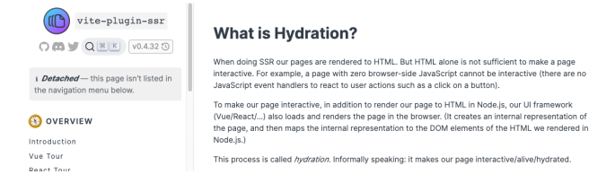

## 一. **认识和体验Hooks** 

### 1.1 **为什么需要Hook?**

- **Hook** **是 React 16.8 的新增特性，它可以让我们在不编写class的情况下使用state以及其他的React特性（比如生命周期）**
- **先来思考一下class组件相对于函数式组件有什么优势？比较常见的是下面的优势：**
  - class组件可以定义自己的state，用来保存组件自己内部的状态
    - 函数式组件不可以，因为函数每次调用都会产生新的临时变量
  - class组件有自己的生命周期，我们可以在对应的生命周期中完成自己的逻辑
    - 比如在componentDidMount中发送网络请求，并且该生命周期函数只会执行一次
    - 函数式组件在学习hooks之前，如果在函数中发送网络请求，意味着每次重新渲染都会重新发送一次网络请求
  - class组件可以在状态改变时只会重新执行render函数以及我们希望重新调用的生命周期函数componentDidUpdate等
    - 函数式组件在重新渲染时，整个函数都会被执行，似乎没有什么地方可以只让它们调用一次
- **所以，在Hook出现之前，对于上面这些情况我们通常都会编写class组件**


### 1.2 **Class组件存在的问题**

- **复杂组件变得难以理解：**
  - 我们在最初编写一个class组件时，往往逻辑比较简单，并不会非常复杂。但是随着业务的增多，我们的class组件会变得越来越复杂
  - 比如componentDidMount中，可能就会包含大量的逻辑代码：包括网络请求、一些事件的监听（还需要在componentWillUnmount中移除）
  - 而对于这样的class实际上非常难以拆分：因为它们的逻辑往往混在一起，强行拆分反而会造成过度设计，增加代码的复杂度
- **难以理解的class：**
  - 很多人发现学习ES6的class是学习React的一个障碍
  - 比如在class中，我们必须搞清楚this的指向到底是谁，所以需要花很多的精力去学习this
- **组件复用状态很难**：
  - 在前面为了一些状态的复用我们需要通过高阶组件
  - 像我们之前学习的redux中connect或者react-router中的withRouter，这些高阶组件设计的目的就是为了状态的复用
  - 或者类似于Provider、Consumer来共享一些状态，但是多次使用Consumer时，我们的代码就会存在很多嵌套
  - 这些代码让我们不管是编写和设计上来说，都变得非常困难


### 1.3 **Hook的出现**

- **Hook的出现，可以解决上面提到的这些问题**
- **简单总结一下hooks：**
  - 它可以让我们在不编写class的情况下使用state以及其他的React特性
  - 但是我们可以由此延伸出非常多的用法，来让我们前面所提到的问题得到解决
- **Hook的使用场景：**
  - Hook的出现基本可以代替我们之前所有使用class组件的地方
  - 但是如果是一个旧的项目，你并不需要直接将所有的代码重构为Hooks，因为它**完全向下兼容，你可以渐进式的来使用它**
  - **Hook只能在函数组件中使用，不能在类组件，或者函数组件之外的地方使用**
- **在我们继续之前，请记住 Hook 是：**
  - **完全可选的**：你无需重写任何已有代码就可以在一些组件中尝试 Hook。但是如果你不想，你不必现在就去学习或使用 Hook
  - **100% 向后兼容的**：Hook 不包含任何破坏性改动
  - **现在可用**：Hook 已发布于 v16.8.0


### 1.4 **Class组件和Functional组件对比**


### 1.5  **计数器案例对比**

- **我们通过一个计数器案例，来对比一下class组件和函数式组件结合hooks的对比：**


- **你会发现上面的代码差异非常大：**
  - **函数式组件结合hooks让整个代码变得非常简洁**
  - **并且再也不用考虑this相关的问题**


## 二. **useState**

### 2.1 **useState解析**

- **我们来研究一下核心的一段代码代表什么意思：**

- useState来自react，需要从react中导入，它是一个hook
  - 参数：初始化值，如果不设置为**undefined**
  - 返回值：**数组**，包含**两个元素**
    - 元素一：**当前状态的值（第一调用为初始化值**）
    - 元素二：**设置状态值的函数**
  - 点击button按钮后，会完成两件事情：
    - **调用setCounter，设置一个新的值**
    - **组件重新渲染**，并且根据**新的值返回DOM结构**
  - **Hook 就是 JavaScript 函数，这个函数可以帮助你 钩入（hook into） React State以及生命周期等特性**
  - **但是使用它们会有两个额外的规则：**
    - 只能在**函数最外层调用 Hook**。**不要在循环、条件判断或者子函数中调用**
    - 只能在 **React 的函数组件中调用 Hook**。**不要在其他 JavaScript 函数中调用**
  - Tip：
    - Hook指的类似于useState、useEffect这样的函数
    - Hooks是对这类函数的统称


### 2.2 **认识useState**

- **State Hook的API就是 useState，我们在前面已经进行了学习：**
  - **useState**会帮助我们**定义一个 state变量**，useState 是一种新方法，**它与 class 里面的 this.state 提供的功能完全相同**
    - ✓ 一般来说，在**函数退出后变量就会”消失”，而 state 中的变量会被 React 保留**
  - **useState**接受**唯一一个参数**，在**第一次组件被调用时使用来作为初始化值**。（如果没有传递参数，那么初始化值为undefined）
  - **useState**的**返回值是一个数组**，我们可以**通过数组的解构**，来完成赋值会非常方便
- **FAQ：为什么叫 useState 而不叫 createState?**
  - create” 可能不是很准确，**因为 state 只在组件首次渲染的时候被创建**
  - **在下一次重新渲染时，useState 返回给我们当前的 state**
  - **如果每次都创建新的变量，它就不是 “state”了**
  - 这也是 **Hook 的名字*总是*以 use 开头的一个原因**


## 三. useEffect

### 3.1 **认识Effect Hook**

- **目前我们已经通过hook在函数式组件中定义state，那么类似于生命周期这些呢？**
  - Effect Hook 可以让你来完成一些类似于**class中生命周期的功能**
  - 事实上，类似**于网络请求、手动更新DOM、一些事件的监听，都是React更新DOM的一些副作用（Side Effects）**
  - 所以**对于完成这些功能的Hook被称之为 Effect Hook**
- 假如我们现在有一个需求：**页面的title总是显示counter的数字，分别使用class组件和Hook实现：**


- **useEffect的解析：**
  - 通过useEffect的Hook，可以告诉**React需要在渲染后执行某些操作**
  - useEffect**要求我们传入一个回调函数**，在**React执行完更新DOM操作之后，就会回调这个函数**
  - 默认情况下，无论是**第一次渲染之后**，还是**每次更新之后，都会执行这个 回调函数**


### 3.2 **需要清除Effect**

- **在class组件的编写过程中，某些副作用的代码，我们需要在componentWillUnmount中进行清除**
  - 比如我们之前的**事件总线或Redux中手动调用subscribe**
  - 都需要在**componentWillUnmount有对应的取消订阅**
  - Effect Hook通过什么方式来模拟componentWillUnmount呢？
- **useEffect传入的回调函数A本身可以有一个返回值，这个返回值是另外一个回调函数B：**
  - **type EffectCallback = () => (void | (() => void | undefined))**
- **为什么要在 effect 中返回一个函数？**
  - 这是 **effect 可选的清除机制。每个 effect 都可以返回一个清除函数**
  - 如此可以**将添加和移除订阅的逻辑放在一起**
  - 它们都属于 **effect 的一部分**
- **React 何时清除 effect？**
  - React 会在**组件更新和卸载的时候执行清除操作**
  - 正如之前学到的，**effect 在每次渲染的时候都会执行**


### 3.3 **使用多个Effect**

- **使用Hook的其中一个目的就是解决class中生命周期经常将很多的逻辑放在一起的问题：**
  - 比如网络请求、事件监听、手动修改DOM，这些往往都会放在componentDidMount中
- **使用Effect Hook，我们可以将它们分离到不同的useEffect中**
- **Hook 允许我们按照代码的用途分离它们，** 而不是像生命周期函数那样：
  - React 将按照 **effect 声明的顺序依次调用组件中的*每一个* effect**


### 3.4 **Effect性能优化**

- **默认情况下，useEffect的回调函数会在每次渲染时都重新执行，但是这会导致两个问题：**
  - 某些代码我们只是希望执行一次即可，类似于componentDidMount和componentWillUnmount中完成的事情；（比如网络请求、订阅和取消订阅）
  - 另外，多次执行也会导致一定的性能问题
- **我们如何决定useEffect在什么时候应该执行和什么时候不应该执行呢？**
  - useEffect实际上有两个参数：
    - 参数一：**执行的回调函数**
    - 参数二：**该useEffect在哪些state发生变化时，才重新执行**；（受谁的影响）
- **但是，如果一个函数我们不希望依赖任何的内容时，也可以传入一个空的数组 []：**
  -  那么**这里的两个回调函数分别对应的就是componentDidMount和componentWillUnmount生命周期函数了**


## 四. **useContext**

- **在之前的开发中，我们要在组件中使用共享的Context有两种方式：**
  - 类组件可以通过 **类名.contextType = MyContext方式，在类中获取context**
  - 多个Context或者在函数式组件中通过 **MyContext.Consumer 方式共享context**
- **但是多个Context共享时的方式会存在大量的嵌套：**
  - Context Hook允许我们通过Hook来直接获取某个Context的值


- **注意事项：**
  - **当组件上层最近的 <MyContext.Provider> 更新时，该 Hook 会触发重新渲染，并使用最新传递给 MyContext provider 的context value 值**


## 五. **useReducer**

- **很多人看到useReducer的第一反应应该是redux的某个替代品，其实并不是**
- **useReducer仅仅是useState的一种替代方案：**
  - 在某些场景下，如果state的处理逻辑比较复杂，我们可以通过useReducer来对其进行拆分
  - 或者这次修改的state需要依赖之前的state时，也可以使用


- **数据是不会共享的，它们只是使用了相同的counterReducer的函数而已**
- **所以，useReducer只是useState的一种替代品，并不能替代Redux**


## 六. **useCallback**

- **`useCallback` 是一个允许你在多次渲染中缓存函数的 React Hook**

- **useCallback实际的目的是为了进行性能的优化。**

- ```js
  const cachedFn = useCallback(fn, dependencies)
  ```

  - `fn`：**想要缓存的函数**。**此函数可以接受任何参数并且返回任何值。React 将会在初次渲染而非调用时返回该函数**。
  - `dependencies`：**有关是否更新 `fn` 的所有响应式值的一个列表。响应式值包括 props、state，和所有在你组件内部直接声明的变量和函数**

- **如何进行性能的优化呢？**

  - **useCallback会返回一个函数的 memoized（记忆的） 值**
  - **在依赖不变的情况下，多次定义的时候，返回的值是相同的**

- #### 返回值 

  - 在初次渲染时，`useCallback` 返回你已经传入的 `fn` 函数
  - 在之后的渲染中，如果依赖没有改变，`useCallback` 返回上一次渲染中缓存的 `fn` 函数；否则返回这一次渲染传入的 `fn`。

- **通常使用useCallback的目的是不希望子组件进行多次渲染，并不是为了函数进行缓存**


## 七. **useMemo**

- **useMemo实际的目的也是为了进行性能的优化**

  - useMemo返回的也是一个 memoized（记忆的） 值

  - 在依赖不变的情况下，多次定义的时候，返回的值是相同的

  - 它在**每次重新渲染的时候能够缓存计算的结果**

  - ```js
    const cachedValue = useMemo(calculateValue, dependencies)
    ```

    - `calculateValue`：要缓存计算值的函数。它应该是一个没有任何参数的纯函数，并且可以返回任意类型。React 将会在首次渲染时调用该函数；在之后的渲染中，如果 `dependencies` 没有发生变化，React 将直接返回相同值。否则，将会再次调用 `calculateValue` 并返回最新结果，然后缓存该结果以便下次重复使用
    - `dependencies`：所有在 `calculateValue` 函数中使用的响应式变量组成的数组。响应式变量包括 props、state 和所有你直接在组件中定义的变量和函数。

  - #### 返回值 

    - 在初次渲染时，`useMemo` 返回不带参数调用 `calculateValue` 的结果
    - 在接下来的渲染中，如果依赖项没有发生改变，它将返回上次缓存的值；否则将再次调用 `calculateValue`，并返回最新结果


## 八. **useRef**

- **useRef返回一个ref对象，返回的ref对象再组件的整个生命周期保持不变**

- **最常用的ref是两种用法：**

  - 用法一：引入DOM（或者组件，但是需要是class组件）元素

  - 用法二：保存一个数据，这个对象在整个生命周期中可以保存不变

  - ```js
    const ref = useRef(initialValue)
    ```

    


## 九. **useImperativeHandle**

- **先来回顾一下ref和forwardRef结合使用：**

  - 通过forwardRef可以将ref转发到子组件
  - 子组件拿到父组件中创建的ref，绑定到自己的某一个元素中

- **forwardRef的做法本身没有什么问题，但是我们是将子组件的DOM直接暴露给了父组件：**

  - 直接暴露给父组件带来的问题是某些情况的不可控
  - 父组件可以拿到DOM后进行任意的操作
  - 我们只是希望父组件可以操作的focus，其他并不希望它随意操作

- **通过useImperativeHandle可以值暴露固定的操作：**

  - 通过useImperativeHandle的Hook，将传入的ref和useImperativeHandle第二个参数返回的对象绑定到了一起

  - 在父组件中，使用 inputRef.current时，实际上使用的是返回的对象

  - ```js
    useImperativeHandle(ref, createHandle, dependencies?)
    ```

    - `ref`：该 `ref` 是你从 [`forwardRef` 渲染函数](https://zh-hans.react.dev/reference/react/forwardRef#render-function) 中获得的第二个参数
    - `createHandle`：该函数无需参数，它返回你想要暴露的 ref 的句柄。该句柄可以包含任何类型。通常，你会返回一个包含你想暴露的方法的对象
    - **可选的** `dependencies`：函数 `createHandle` 代码中所用到的所有反应式的值的列表。反应式的值包含 props、状态和其他所有直接在你组件体内声明的变量和函数


## 十. **useLayoutEffect**

- **useLayoutEffect看起来和useEffect非常的相似，事实上他们也只有一点区别而已：**

  - useEffect会在渲染的内容更新到DOM上后执行，不会阻塞DOM的更新
  - useLayoutEffect会在渲染的内容更新到DOM上之前执行，会阻塞DOM的更新

- **`useLayoutEffect` 是 [`useEffect`](https://zh-hans.react.dev/reference/react/useEffect) 的一个版本，在浏览器重新绘制屏幕之前触发**

  - ```js
    useLayoutEffect(setup, dependencies?)
    ```

    - `setup`：处理副作用的函数。setup 函数选择性返回一个*清理*（cleanup）函数。在将组件首次添加到 DOM 之前，React 将运行 setup 函数
    - **可选** `dependencies`：`setup` 代码中引用的所有响应式值的列表。响应式值包括 props、state 以及所有直接在组件内部声明的变量和函数

- **如果我们希望在某些操作发生之后再更新DOM，那么应该将这个操作放到useLayoutEffect**

- **注意:**

  - `useLayoutEffect` 可能会影响性能。尽可能使用 [`useEffect`](https://zh-hans.react.dev/reference/react/useEffect)


## 十一. **自定义Hook**

- **自定义Hook本质上只是一种函数代码逻辑的抽取，严格意义上来说，它本身并不算React的特性**
- **Hook 的名称必须永远以 `use` 开头** 
  - **React 组件名称必须以大写字母开头**，比如 `StatusBar` 和 `SaveButton`。React 组件还需要返回一些 React 能够显示的内容，比如一段 JSX
  - **Hook 的名称必须以后跟一个大写字母的 `use` 开头**，像 [`useState`](https://zh-hans.react.dev/reference/react/useState)（内置） 或者 `useOnlineStatus`（像本文早前的自定义 Hook）。Hook 可以返回任意值

- **需求一：打印生命周期**


- **需求二：Context的共享**


- **需求三：获取滚动位置**


## 十二. **redux hooks**

- **在之前的redux开发中，为了让组件和redux结合起来，我们使用了react-redux中的connect：**
  - 但是这种方式必须使用高阶函数结合返回的高阶组件
  - 并且必须编写：mapStateToProps和 mapDispatchToProps映射的函数
- **在Redux7.1开始，提供了Hook的方式，我们再也不需要编写connect以及对应的映射函数了**
- **useSelector的作用是将state映射到组件中：**
  - 参数一：将state映射到需要的数据中
  - 参数二：可以进行比较来决定是否组件重新渲染
- **useSelector**默认会比较我们返回的两个对象是否相等**
  - 如何比较呢？ const refEquality = (a, b) => a === b
  - 也就是我们必须返回两个完全相等的对象才可以不引起重新渲染
- **useDispatch就是直接获取dispatch函数，之后在组件中直接使用即可**
- **我们还可以通过useStore来获取当前的store对象**

.png)

.png)


## 十三. **useId**

- **官方的解释：useId 是一个用于生成横跨服务端和客户端的稳定的唯一 ID 的同时避免 hydration 不匹配的 hook**


### 13.1 SSR

- **这里有一个词叫hydration，要想理解这个词，我们需要理解一些服务器端渲染（SSR）的概念**
- **什么是SSR？**
  - SSR（**Server Side Rendering，服务端渲染**），指的是页面在服务器端已经生成了完成的HTML页面结构，不需要浏览器解析
  - 对应的是CSR（**Client Side Rendering，客户端渲染**），我们开发的SPA页面通常依赖的就是客户端渲染


- **早期的服务端渲染包括PHP、JSP、ASP等方式，但是在目前前后端分离的开发模式下，前端开发人员不太可能再去学习PHP、JSP等技术来开发网页**
- **不过我们可以借助于Node来帮助我们执行JavaScript代码，提前完成页面的渲染**


### 13.2 **SSR同构应用**

- **什么是同构？**
  -  一套代码既可以在服务端运行又可以在客户端运行，这就是同构应用
- **同构是一种SSR的形态，是现代SSR的一种表现形式**
  - 当用户发出请求时，先在服务器通过SSR渲染出首页的内容
  - 但是对应的代码同样可以在客户端被执行
  - 执行的目的包括事件绑定等以及其他页面切换时也可以在客户端被渲染


### 13.3 **Hydration**

- **什么是Hydration？这里引入vite-plugin-ssr插件的官方解释**



- **在进行** **SSR** **时，我们的页面会呈现为** **HTML**
  - 但仅 HTML 不足以使页面具有交互性。例如，浏览器端 JavaScript 为零的页面不能是交互式的（没有 JavaScript 事件处理程序来响应用户操作，例如单击按钮）
  - 为了使我们的页面具有交互性，除了在 Node.js 中将页面呈现为 HTML 之外，我们的 UI 框架（Vue/React/...）还在浏览器中加载和呈现页面。（它创建页面的内部表示，然后将内部表示映射到我们在 Node.js 中呈现的 HTML 的 DOM 元素。）
- **这个过程称为hydration**


### 13.4 **useId的作用**

- **useId 是一个用于生成横跨服务端和客户端的稳定的唯一 ID 的同时避免 hydration 不匹配的 hook**
- **所以我们可以得出如下结论：**
  - useId是用于react的同构应用开发的，前端的SPA页面并不需要使用它
  - useId可以保证应用程序在客户端和服务器端生成唯一的ID，这样可以有效的避免通过一些手段生成的id不一致，造成hydration mismatch


## 十四. **useTransition**

- **官方解释：返回一个状态值表示过渡任务的等待状态，以及一个启动该过渡任务的函数**

- **`useTransition` 是一个让你在不阻塞 UI 的情况下来更新状态的 React Hook**

  - ```js
    const [isPending, startTransition] = useTransition()
    ```

    - `useTransition` 不需要任何参数
    - `useTransition` 返回一个由两个元素组成的数组：
      - `isPending` 标志，告诉你是否存在待处理的转换
      - [`startTransition` 函数](https://zh-hans.react.dev/reference/react/useTransition#starttransition) 允许你将状态更新标记为转换状态

- **它其实在告诉react对于某部分任务的更新优先级较低，可以稍后进行更新**


## 十五. **useDeferredValue**

- **官方解释：useDeferredValue 接受一个值，并返回该值的新副本，该副本将推迟到更紧急地更新之后**
- **在明白了useTransition之后，我们就会发现useDeferredValue的作用是一样的效果，可以让我们的更新延迟**


