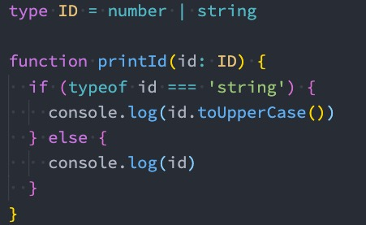
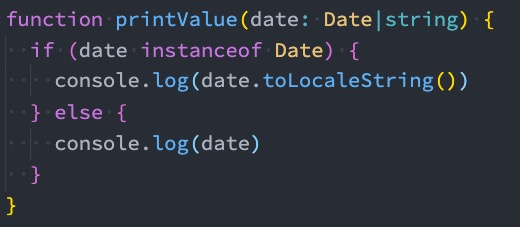
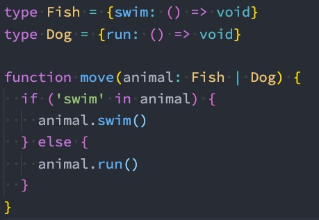
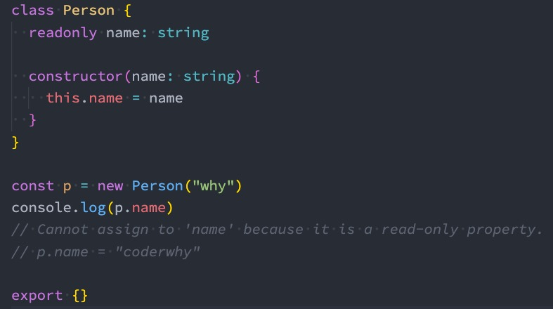
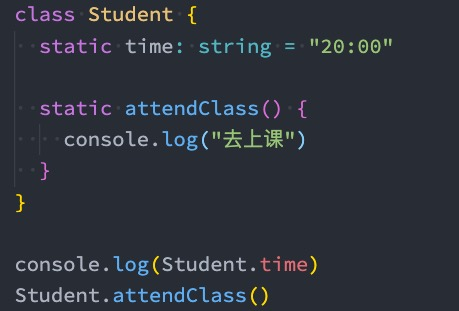

# Typescript语法

## 一、**类型缩小**

什么是类型缩小呢？ 

类型缩小的英文是 Type Narrowing； 我们可以通过类似于 typeof padding === "number" 的判断语句，来改变TypeScript的执行路径； 在给定的执行路径中，我们可以缩小比声明时更小的类型，这个过程称之为 缩小; 而我们编写的 typeof padding === "number 可以称之为 **类型保护**（type guards）； 

常见的类型保护有如下几种： 

typeof 

平等缩小（比如===、!==） 

instanceof 

in 

等等...

### 1.1 **typeof**

在 TypeScript 中，检查返回的值typeof是一种类型保护：因为 TypeScript 对如何typeof操作不同的值进行编码



### 1.2 **平等缩小**

我们可以使用Switch或者相等的一些运算符来表达相等性（比如===, !==, ==, and != ）：


### 1.3 **instanceof**

JavaScript 有一个运算符来检查一个值是否是另一个值的“实例”：



### 1.4 **in**

Javascript 有一个运算符，用于确定对象是否具有带名称的属性：in运算符

如果**指定的属性在指定的对象或其原型链中，则in 运算符返回true**



## 二、**TypeScript函数类型**

在JavaScript开发中，函数是重要的组成部分，并且函数可以作为一等公民（可以作为参数，也可以作为返回值进行传递）。

那么在使用函数的过程中，函数是否也可以有自己的类型呢？

我们可以**编写函数类型的表达式（Function Type Expressions），来表示函数类型**


### 2.1 **TypeScript函数类型解析**

在上面的语法中 **(num1: number, num2: number) => void**，代表的就是一个函数类型：

接收两个参数的函数：num1和num2，并且都是number类型，并且这个函数是没有返回值的，所以是void

在某些语言中，可能参数名称num1和num2是可以省略，但是TypeScript是不可以的：


### 2.2 **参数的可选类型**

我们可以指定某个参数是可选的： 

```typescript
function foo(x: number, y?: number) {
  console.log(x, y)
}
```

这个时候这个参数y依然是有类型的，它是什么类型呢？ number | undefined

**可选类型需要在必传参数的后面：**

### 2.3 **默认参数**

从ES6开始，JavaScript是支持默认参数的，TypeScript也是支持默认参数的： 


**这个时候y的类型其实是 undefined 和 number 类型的联合**

### 2.4 **剩余参数**

从ES6开始，JavaScript也支持剩余参数，**剩余参数语法允许我们将一个不定数量的参数放到一个数组中**


## 三、**Typescript中的this**

### 3.1 **可推导的this类型**

this是JavaScript中一个比较难以理解和把握的知识点：因为this在不同的情况下会绑定不同的值，所以对于它的类型就更难把握了

那么，TypeScript是如何处理this呢？我们先来看一个例子：


上面的代码是可以正常运行的，也就是TypeScript在编译时，认为我们的this是可以正确去使用的：

TypeScript认为函数 sayHello 有一个对应的this的外部对象 info，所以在使用时，就会把this当做该对象

### 3.2 **不确定的this类型**

但是对于某些情况来说，我们并不知道this到底是什么？ 


这段代码运行会报错的：

这里我们再次强调一下，TypeScript进行类型检测的目的是让我们的代码更加的安全；所以这里对于 sayHello 的调用来说，我们虽然将其放到了info中，通过info去调用，this依然是指向info对象的。但是对于TypeScript编译器来说，这个代码是非常不安全的，因为我们也有可能直接调用函数，或者通过别的对象来调用函数

### 3.3 **指定this的类型**

这个时候，**通常TypeScript会要求我们明确的指定this的类型**：


## 四、**函数的重载**

在TypeScript中，如果我们编写了一个add函数，希望可以对字符串和数字类型进行相加，应该如何编写呢？

我们可能会这样来编写，但是其实是错误的： 


那么这个代码应该如何去编写呢？

在TypeScript中，我们可以去**编写不同的重载签名**（*overload signatures*）来表示函数可以以不同的方式进行调用

一般是编写两个或者以上的重载签名，再去编写一个通用的函数以及实现

### 4.1 **sum函数的重载**

我们对sum函数进行重构：

在我们调用sum的时候，它**会根据我们传入的参数类型来决定执行函数体时，到底执行哪一个函数的重载签名**

```typescript
function sum(a1: number, a2: number): number
function sum(a1: string, a2: string): string
function sum(a1: any, a2: any): any {
  reutrn a1 + a2
}

sum(10, 20)
sum('aaa', 'bbb')
```

**但是注意，有实现体的函数，是不能直接被调用的**


### 4.2 **联合类型和重载**

我们现在有一个需求：定义一个函数，可以传入字符串或者数组，获取它们的长度

这里有两种实现方案： 

方案一：使用联合类型来实现； 

方案二：实现函数重载来实现

```typescript
// 联合类型
function getLength(a: string | any[]) {
  return a.length
}
// 函数重载
function getLength(a: string): number
function getLength(a: any[]): number
function getLength(a: any): number {
  return a.length
}
getLength('abc')
getLength(['abc', 'cba', 'nba'])
```

在可能的情况下，**尽量选择使用联合类型来实现**

## 五、**类的使用**

### 5.1 **认识类的使用**

在早期的JavaScript开发中（ES5）我们需要通过函数和原型链来实现类和继承，从ES6开始，引入了class关键字，可以 

更加方便的定义和使用类。 

TypeScript作为JavaScript的超集，也是支持使用class关键字的，并且还**可以对类的属性和方法等进行静态类型检测**。 

实际上在JavaScript的开发过程中，我们**更加习惯于函数式编程**： 

比如React开发中，**目前更多使用的函数组件以及结合Hook的开发模式**

比如在Vue3开发中，目**前也更加推崇使用 Composition API**

但是在**封装**某些业务的时候，**类具有更强大封装性**，所以我们也需要掌握它们

类的定义我们通常会使用class关键字： 

**在面向对象的世界里，任何事物都可以使用类的结构来描述； 类中包含特有的属性和方法**

### 5.2 **类的定义**

**我们来定义一个Person类：** 

使用class关键字来定义一个类； 我们可以声明一些类的属性：在类的内部声明类的属性以及对应的类型 

如果类型没有声明，那么它们默认是any的； 我们也可以给属性设置初始化值

在**默认的strictPropertyInitialization模式下面我们的属性是必须初始化的**，如果没有初始化，那么编译时就会报错； 

如果我们在strictPropertyInitialization模式下确实不希望给属性初始化，可以使用 **name!: string语法**

类可以有自己的**构造函数constructor**，当我们通过new关键字创建一个实例时，构造函数会被调用； 

构造函数不需要返回任何值，默认返回当前创建出来的实例； 类中可以有自己的函数，**定义的函数称之为方法**

```typescript
class Person {
  constructor(name: string, age: number) {
      this.name = name
      this.age = age
  }
  runnning() {
       console.log(this.name + 'running')
  }
}
```

### 5.3 **类的继承**

面向对象的其中一大特性就是**继承**，继承不仅仅可以减少我们的代码量，也是**多态的使用前提**。 我们使用**extends**关键字来实现继承，**子类中使用super来访问父类**。 

我们来看一下Student类继承自Person： 

Student类可以有自己的属性和方法，并且会继承Person的属性和方法； 

在构造函数中，我们可以通过super来调用父类的构造方法，对父类中的属性进行初始化

```typescript
class Student extends Person {
  constructor(name: tring, age: number, sno: number) {
       super(name, age)
       this.sno = sno
  }
  eating() {
     console.log(this.name + 'eating')
  }
  running() {
    super.running()
    console.log('student running')
  }
}
```

### 5.4 **类的成员修饰符**

在TypeScript中，类的属性和方法支持三种修饰符： **public、private、protected** 

public 修饰的是在任何地方可见、公有的属性或方法，默认编写的属性就是public的

private 修饰的是仅在同一类中可见、私有的属性或方法

protected 修饰的是仅在类自身及子类中可见、受保护的属性或方法； 

public是默认的修饰符，也是可以直接访问的，我们这里来演示一下protected和private


### 5.5 **只读属性readonly**

如果有一个属性我们不希望外界可以任意的修改，只希望确定值后直接使用，那么可以使用readonly：



### 5.6 **getters/setters**

在前面一些私有属性我们是不能直接访问的，或者某些属性我们想要监听它的获取(getter)和设置(setter)的过程， 

这个时候我们可以使用存取器

.png)

.png)

### 5.7 **静态成员**

前面我们在类中定义的成员和方法都属于对象级别的, 在开发中, 我们有时候也需要定义类级别的成员和方法。 

在TypeScript中通过关键字**static**来定义



### 5.8 **抽象类abstract**

我们知道，继承是多态使用的前提。 

所以在定义很多通用的**调用接口时, 我们通常会让调用者传入父类，通过多态来实现更加灵活的调用方式。** 

**但是，父类本身可能并不需要对某些方法进行具体的实现，所以父类中定义的方法,，我们可以定义为抽象方法。** 

**什么是 抽象方法? 在TypeScript中没有具体实现的方法(没有方法体)，就是抽象方法。** 

**抽象方法，必须存在于抽象类中； 抽象类是使用abstract声明的类；** 

抽象类有如下的特点： 

**抽象类是不能被实例化的（也就是不能通过new创建）** 

**抽象方法必须被子类实现，否则该类必须是一个抽象类**


### 5.9 **类的类型**

类本身也是可以作为一种数据类型的：

