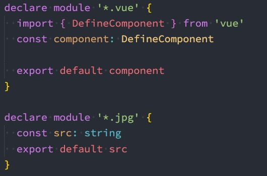

# Typescript语法

## 一、**Typescript接口**

### 1.1 **接口的声明**

在前面我们**通过type可以用来声明一个对象类型**：

对象的另外一种声明方式就是**通过接口来声明**：

```typescript
// type声明对象类型
type PointType = {
  x: number,
  y: number
}

// interface（接口）声明对象类型
interface IPoint {
  x: number,
  y: number
}
```

### 1.2 **可选属性**

接口中我们也可以定义可选属性：

```typescript
interface IPoint {
  x: number,
  y: number,
  z?: number
}
 const obj: IPoint = {
     x: 10,
     y: 20
 }
```

### 1.3 **只读属性**

接口中也可以定义只读属性：这样就意味着我们再初始化之后，这个值是不可以被修改的；


### 1.4 **索引类型**

前面我们使用interface来定义对象类型，这个时候其中的属性名、类型、方法都是确定的，但是有时候我们会遇到类似下面的对象：


### 1.5 **函数类型**

前面我们都是通过interface来定义对象中普通的属性和方法的，实际上它也可以用来定义函数类型：


当然，除非特别的情况，还是**推荐使用类型别名来定义函数：**

```typescript
type CalcFuncType = (num1: number, num2: number) => number
```

### 1.6 **接口继承**

接口和类一样是可以进行继承的，也是使用**extends**关键字，而且**接口是支持多继承的（类不支持多继承）**


### 1.7 **接口的实现**

接口定义后，也是可以被类实现的： 如果被一个类实现，那么在之后需要传入接口的地方，都可以将这个类传入

这就是**面向接口开发**

```typescript
interface ISwim {
  swimming: () => void
}
interface IRun {
  running： () => void
}

class Person implements ISwim, IRun {
  swimming() {
       console.log('swimming')
  }
  running() {
    console.log('running')
  }
}

function swim(swimmer: ISwim) {
  swimmer.swimming()
}

const p = new Person()
swim(p)
```

### 1.8 **交叉类型**

**联合类型表示多个类型中一个即可**

```typescript
type PrintType = 'left' | 'right' | 'top' | 'btootm'
```

还有另外一种类型合并，就是**交叉类型**（Intersection Types）：

**交叉类型表示需要满足多个类型的条件，交叉类型使用 & 符号**

看下面的交叉类型：

表达的含义是**number和string要同时满足**

但是有同时满足是一个number又是一个string的值吗？其实是没有的，所以**MyType其实是一个never类型**

```typescript
type MyType = number & string
```

#### 1.8.1 **交叉类型的应用**

在开发中，我们进行交叉时，通常是对对象类型进行交叉的：


### 1.9 **interface和type区别**

我们会发现**interface和type都可以用来定义对象类型**，那么在开发中定义对象类型时，到底选择哪一个呢？ 

如果是**定义非对象类型，通常推荐使用type，比如Direction、Alignment、一些Function**

如果是**定义对象类型，那么他们是有区别的**： 

**interface 可以重复的对某个接口来定义属性和方法**

**type定义的是别名，别名是不能重复的**


### 1.10 **字面量赋值**


**TypeScript在字面量直接赋值的过程中，为了进行类型推导会进行严格的类型限制**。 但是之后如果**我们是将一个 变量标识符 赋值给其他的变量时，会进行freshness擦除操作**

## 二、**TypeScript枚举类型**

**枚举类型是为数不多的TypeScript特性有的特性之一**： 

**枚举其实就是将一组可能出现的值，一个个列举出来，定义在一个类型中，这个类型就是枚举类型**； **枚举允许开发者定义一组命名常量，常量可以是数字、字符串类型**


### 2.1 **枚举类型的值**

枚举类型默认是有值的，比如上面的枚举，默认值是这样的： 

当然，我们也可以给枚举其他值： 这个时候会从100进行递增

我们也可以给他们赋值其他的类型：


## 三、**泛型**

### 3.1 **认识泛型**

软件工程的主要目的是构建不仅仅明确和一致的API，还要让你的代码具有很强的可重用性： 比如我们可以通过函数来封装一些API，通过传入不同的函数参数，让函数帮助我们完成不同的操作； 

但是对于参数的类型是否也可以参数化呢？ 

什么是类型的参数化？ 

我们来提一个需求：封装一个函数，传入一个参数，并且返回这个参数； 如果我们是TypeScript的思维方式，**要考虑这个参数和返回值的类型需要一致**

```typescript
function foo(age: number): number {
  return age
}
```

上面的代码虽然实现了，但是**不适用于其他类型，比如string、boolean、Person等类型**，不过我们可以**使用any类型**

```typescript
function foo(age: any): any {
  return age
}
```

### 3.2 **泛型实现类型参数化**

虽然any是可以的，但是定义为any的时候，我们其实已经丢失了类型信息： 

比如我们传入的是一个number，那么我们希望返回的可不是any类型，而是number类型； 所以，我们需要在函数中可以捕获到参数的类型是number，并且同时使用它来作为返回值的类型； 我们需要在这里**使用一种特性的变量 - 类型变量（type variable），它作用于类型，而不是值**：

```typescript
function foo<Type>(age: Type): Type {
  return age
}
```

**我们可以使用两种方式来调用它：** 

方式一：通过 <类型> 的方式将类型传递给函数

方式二：通过类型推导，自动推到出我们传入变量的类型

在这里会推导出它们是 字面量类型的，因为字面量类型对于我们的函数也是适用的

```typescript
// 1.
foo<string>('abc')
foo<number>(18)
// 2.
foo('abc')
foo(18)
```

我们也可以传入多个类型：

```typescript
function foo<T, E>(a1: T, a2: E) {
  
}
```

平时在开发中我们可能会看到一些常用的名称： 

T：Type的缩写，类型 

K、V：key和value的缩写，键值对 

E：Element的缩写，元素 

O：Object的缩写，对象

### 3.3 **泛型接口**

在定义接口的时候我们也可以使用泛型：


### 3.4 **泛型类**

我们也可以编写一个泛型类：


### 3.5 **泛型约束**

有时候我们希望传入的类型有某些共性，但是这些共性可能不是在同一种类型中： 比如string和array都是有length的，或者某些对象也是会有length属性的； 那么只要是拥有length的属性都可以作为我们的参数类型，那么应该如何操作呢？


## 四、**模块化开发**

TypeScript支持两种方式来控制我们的作用域： 

**模块化**：每个文件可以是一个独立的模块，支持ES Module，也支持CommonJS

**命名空间**：通过namespace来声明一个命名空间


### 4.1 **命名空间namespace**

**命名空间在TypeScript早期时，称之为内部模块，主要目的是将一个模块内部再进行作用域的划分，防止一些命名冲突的问题**


## 五、**类型的查找**

之前我们所有的typescript中的类型，几乎都是我们自己编写的，但是我们也有用到一些其他的类型：


我们的HTMLImageElement类型来自哪里呢？甚至是document为什么可以有getElementById的方法呢？ 

其实这里就涉及到**typescript对类型的管理和查找规则**了。 

我们这里先介绍另外的一种typescript文件：

**.d.ts文件** 

我们之前编写的typescript文件都是 **.ts 文件，这些文件最终会输出 .js 文件，也是我们通常编写代码的地方**； 还有另外一种文件 **.d.ts 文件**，它是**用来做类型的声明(declare)**。 它仅仅用来做类型检测，告知typescript我们有哪些类型

那么typescript会在哪里查找我们的类型声明呢？ 

**内置类型声明**

**外部定义类型声明**

**自己定义类型声明**

### 5.1 **内置类型声明**

内置类型声明是typescript自带的、帮助我们内置了JavaScript运行时的一些标准化API的声明文件； 包括比如Math、Date等内置类型，也包括DOM API，比如Window、Document等； 内置类型声明通常**在我们安装typescript的环境中会带有的**

https://github.com/microsoft/TypeScript/tree/main/lib

### 5.2 **外部定义类型声明**

外部类型声明通常是我们**使用一些库（比如第三方库）时，需要的一些类型声明**。 

**这些库通常有两种类型声明方式：** 

方式一：**在自己库中进行类型声明（编写.d.ts文件），比如axios** 

方式二：**通过社区的一个公有库DefinitelyTyped存放类型声明文件**

该库的GitHub地址：https://github.com/DefinitelyTyped/DefinitelyTyped/

该库查找声明安装方式的地址：https://www.typescriptlang.org/dt/search?search=

比如我们安装react的类型声明： **npm i @types/react --save-dev**

什么情况下需要自己来定义声明文件呢？

情况一：**我们使用的第三方库是一个纯的JavaScript库，没有对应的声明文件；比如lodash**

情况二：**我们给自己的代码中声明一些类型，方便在其他地方直接进行使用**

### 5.3 **自定义声明**


### 5.4 **声明模块**

我们也可以声明模块，比如lodash模块默认不能使用的情况，可以自己来声明这个模块：


声明模块的语法: **declare module '模块名' {}**

在声明模块的内部，我们可以**通过 export 导出对应库的类、函数**等

### 5.5 **declare文件**

在某些情况下，我们也可以声明文件： 

比如在开发vue的过程中，默认是不识别我们的.vue文件的，那么我们就需要对其进行文件的声明； 比如在开发中我们使用了 jpg 这类图片文件，默认typescript也是不支持的，也需要对其进行声明



### 5.6 **declare命名空间**

比如我们在index.html中直接引入了jQuery：

CDN地址： https://cdn.bootcdn.net/ajax/libs/jquery/3.6.0/jquery.js

我们可以进行命名空间的声明： 

```typescript
declare namespace $ {
  function ajax(settings: any): void
}
```

在main.ts中就可以使用了：

```typescript
$.ajax({
  url: 'http://123.207.32.32:8000',
  succsee: (res: any) => {
    console.log(res)
  }
})
```

## 六、**tsconfig.json文件**

sconfig.json是用于配置TypeScript编译时的配置选项：

https://www.typescriptlang.org/tsconfig

我们这里看一下几个比较常见的：


