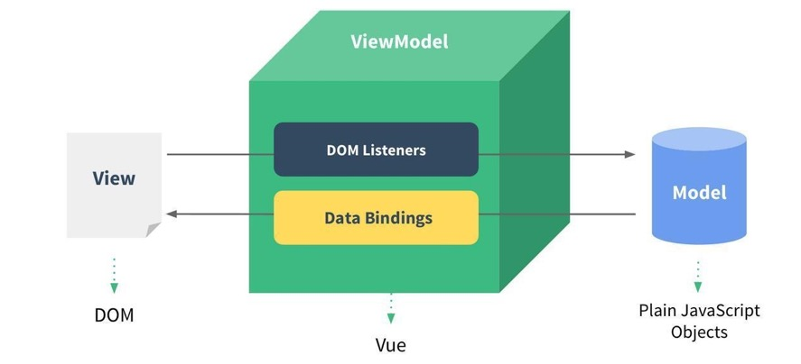

# vue属性和方法

## 一、**声明式和命令式**

原生开发和Vue开发的模式和特点，我们会发现是完全不同的，这里其实涉及到**两种不同的编程范式**： 

**命令式编程和声明式编程**：

命令式编程关注的是 “how to do”，声明式编程关注的是 “what to do”，由框架(机器)完成 “how”的过程

**在原生的实现过程中，我们是如何操作的呢？** 

我们每完成一个操作，都需要通过JavaScript编写一条代码，来给浏览器一个指令； 这样的编写代码的过程，我们称之为**命令式编程**； 在早期的**原生JavaScript和jQuery开发**的过程中，我们都是通过这种命令式的方式在编写代码的

**在Vue的实现过程中，我们是如何操作的呢？** 

我们会在**createApp**传入的对象中声明需要的内容，**模板template、数据data、方法methods**； 这样的编写代码的过程，我们称之为是**声明式编程**； 目前**Vue、React、Angular**的编程模式，我们称之为声明式编程

## 二、**MVVM模型**

MVC和MVVM都是一种软件的体系结构 ：

MVC是Model – View –Controller的简称，是在前期被使用非常框架的架构模式，比如iOS、前端

MVVM是Model-View-ViewModel的简称，是目前非常流行的架构模式； 通常情况下，我们也经常称Vue是一个MVVM的框架。Vue官方其实有说明，Vue虽然并没有完全遵守MVVM的模型，但是整个设计是受到它的启发的



## 三、**template属性**

### 3.1 **template定义**

在使用createApp的时候，我们传入了**一个对象**，接下来我们详细解析一下之前传入的属性分别代表什么含义。 

**template属性：**表示的是Vue需要帮助我们渲染的模板信息，目前我们看到它里面有很多的HTML标签，这些标签会替换掉我们挂载到的元素（比如id为app的div）的innerHTML 

模板中有一些奇怪的语法，比如 {{}}，比如 @click，这些都是模板特有的语法

但是这个模板的写法有点过于别扭了，并且IDE很有可能没有任何提示，阻碍我们编程的效率。 

**Vue提供了两种方式：** 

方式一：使用script标签，并且标记它的类型为 x-template

方式二：使用任意标签（通常使用template标签，因为不会被浏览器渲染），设置id

**template元素是一种用于保存客户端内容的机制，该内容再加载页面时不会被呈现，但随后可以在运行时使用JavaScript实例化**

### 3.2 **template写法**

方式一：使用script标签

方式二：使用template

```javascript
// 方式一
<script type="x-template" id="app">
  <div>
      <h2>{{res}}</h2>
      <button @click="add"></button>
    </div>
</script>

// 方式二
<template id="app">
    <div>
      <h2>{{res}}</h2>
      <button @click="add"></button>
    </div>
  </template>
```

这个时候，在createApp的对象中，我们需要传入的template以 # 开头： 如果字符串是以 # 开始，那么它将被用作 querySelector，并且使用匹配元素的 innerHTML 作为模板字符串

## 四、**data属性**

**data属性**是传入一个函数，并且该函数需要返回一个对象： 在Vue2.x的时候，也可以传入一个对象（虽然官方推荐是一个函数）； 在Vue3.x的时候，必须传入一个函数，否则就会直接在浏览器中报错

**data中返回的对象会被Vue的响应式系统劫持，之后对该对象的修改或者访问都会在劫持中被处理**： 

所以我们在template中通过 {{res}} 访问res，可以从对象中获取到数据； 我们修改res的值时，template中的 {{res}}也会发生改变

## 五、**methods属性**

**methods属性**是一个对象，通常我们会在这个对象中定义很多的方法： 

这些方法可以被绑定到 template 模板中； 在该方法中，我们可以使用this关键字来直接访问到data中返回的对象的属性

官方文档有这么一段描述： 

问题一：为什么不能使用箭头函数（官方文档有给出解释）？ 

问题二：不使用箭头函数的情况下，this到底指向的是什么？


### 5.1 **问题一：不能使用箭头函数？**

我们在methods中要使用data返回对象中的数据： 那么这个this是必须有值的，并且应该可以通过this获取到data返回对象中的数据。 

**那么我们这个this能不能是window呢？**** 

不可以是window，因为window中我们无法获取到data返回对象中的数据； 但是如果我们使用箭头函数，那么这个this就会是window了

**为什么是window呢？** 

这里涉及到箭头函数使用this的查找规则，它会在自己的上层作用于中来查找this； 最终刚好找到的是script作用于中的this，所以就是window

### 5.2 **问题二：this到底指向什么？**

事实上Vue的源码当中就是对methods中的所有函数进行了遍历，并且通过bind绑定了this：


## 六、**模板语法**

**React的开发模式：** 

React使用的jsx，所以对应的代码都是编写的类似于js的一种语法； 之后通过Babel将jsx编译成 React.createElement 函数调用

**Vue也支持jsx的开发模式：** 

但是大多数情况下，使用基于HTML的模板语法； 在模板中，允许开发者以声明式的方式将DOM和底层组件实例的数据绑定在一起； 在底层的实现中，Vue将模板编译成虚拟DOM渲染函数

**Mustache双大括号语法**

如果我们希望把数据显示到模板（template）中，使用最多的语法是 **“Mustache”语法 (双大括号)** 的文本插值。 

并且我们前面提到过，data返回的对象是有添加到Vue的响应式系统中； 当data中的数据发生改变时，对应的内容也会发生更新。 当然，Mustache中不仅仅可以是data中的属性，也可以是一个JavaScript的表达式。 

另外这种用法是错误的

```javascript
<template id="app">
    <div>
      <!-- 基本用法 -->
      <h2>{{res}}</h2>
      <!-- Javascript表达式 -->
      <h2>{{res * 2}}</h2>
      <h2>{{res.split(" ").reverse().join(" ")}}</h2>
      <!-- 调用函数 -->
      <h2>{{getData(props)}}</h2>
      <!-- 三元运算符 -->
      <h2>{{res ? 'aaa' : 'bbb'}}</h2>
      <!-- 错误写法 -->
      <h2>{{var name = 'lcn'}}</h2>
      <h2>{{if(true) {return res}}}</h2>
    </div>
  </template>
```

## 七、**vue指令**

### 7.1 **v-once**

**v-once用于指定元素或者组件只渲染一次：**

当数据发生变化时，**元素或者组件以及其所有的子元素**将视为**静态内容**并且跳过，该指令可以用于**<span style='color:red'>性能优化</span>**

如果是子节点，也是只会渲染一次：

```javascript
<div>
   <h2 v-once>{{res}}</h2>
</div>

<div v-once>
   <h2>{{res}}</h2>
</div>
```

### 7.2 **v-text指令**

用于更新元素的 textContent：

```javascript
<div>
   <h2 v-text="msg"></h2>
   // 等价于
   <h2>{{msg}}</h2>
</div>
```

### 7.3 **v-html**

默认情况下，如果我们展示的内容本身是 html 的，那么vue并不会对其进行特殊的解析。 如果我们希望这个内容被Vue可以解析出来，那么可以使用 v-html 来展示

```javascript
 <template id="app">
    <div>
      <div v-html="msg"></div>
    </div>
  </template>
  <script>
    const App = {
      template: '#app',
      data () {
        return {
          msg: `<span style='color:red;font-size:14px'>哈哈哈</span>`
        }
      }
    }
  </script>
```

### 7.4 **v-pre**

v-pre用于跳过元素和它的子元素的编译过程，显示原始的Mustache标签： 跳过不需要编译的节点，加快编译的速度

```javascript
 <template id="app">
    <div>
      <div v-pre>{{msg}}}</div>
    </div>
  </template>
```

### 7.5 **v-cloak**

这个指令保持在元素上直到关联组件实例结束编译。 

和 CSS 规则如 [v-cloak] { display: none } 一起用时，这个指令可以隐藏未编译的 Mustache 标签直到组件实例准备完毕

```javascript
 <template id="app">
    <div>
      <div v-colak>{{msg}}}</div>
    </div>
  </template>
<style>
 [v-cloak] {
    display:none
 }                                                  
</style>
```

div标签不会显示，直到编译结束

### 7.6 **v-bind的绑定属性**

前面的一系列指令，主要是将值插入到模板内容中。 但是，除了内容需要动态来决定外，**某些属性我们也希望动态来绑定**。 

比如动态绑定a元素的href属性

比如动态绑定img元素的src属性

**绑定属性我们使用v-bind：** 

**缩写**： **:** 

**预期**：any (with argument) | Object (without argument) 

**参数**：attrOrProp (optional) 

**修饰符**： 

.camel - 将 kebab-case attribute 名转换为 camelCase。 

**用法**：动态地绑定一个或多个 attribute，或一个组件 prop 到表达式

#### 7.6.1 **绑定基本属性**

v-bind用于绑定**一个或多个属性值**，或者向另一个组件传递props值

在开发中，有哪些属性需要动态进行绑定呢？ 

比如图片的链接src、网站的链接href、动态绑定一些类、样式等等

v-bind有一个对应的**语法糖**，也就是简写方式。 在开发中，我们通常会使用语法糖的形式，因为这样更加简洁

#### 7.6.2 **绑定class介绍**

在开发中，有时候我们的元素class也是动态的，比如： 

当数据为某个状态时，字体显示红色。 

当数据另一个状态时，字体显示黑色。 

**绑定class有两种方式：** 

对象语法 

数组语法

**对象语法：**我们可以传给 :class (v-bind:class 的简写) 一个对象，以动态地切换 class

**数组语法：**我们可以把一个数组传给 :class，以应用一个 class 列表

#### 7.6.3 **绑定style介绍**

我们可以利用v-bind:style来绑定一些CSS内联样式： 这次因为某些样式我们需要根据数据动态来决定

比如某段文字的颜色，大小等等 

CSS property 名可以用驼峰式 (camelCase) 或短横线分隔 (kebab-case，记得用引号括起来) 来命名； 

**绑定class有两种方式：** 

对象语法 

数组语法

:style 的数组语法可以将多个样式对象应用到同一个元素上

#### 7.6.4 **动态绑定属性**

**在某些情况下，我们属性的名称可能也不是固定的：** 

前面我们无论绑定src、href、class、style，属性名称都是固定的，如果属性名称不是固定的，我们可以使用 **:[属性名]=“值”** 的格式来定义； 这种绑定的方式，我们称之为动态绑定属性

#### 7.6.5 **绑定一个对象**

如果我们希望**将一个对象的所有属性，绑定到元素上的所有属性**，应该怎么做呢？ 

我们可以直接使用 **v-bind** 绑定一个对象

```javascript
<template id="app">
    <div>
      <!--完整写法-->
      
      <!--语法糖写法-->
      
      <!--对象绑定：动态切换class-->
      <div class="lcn" :class="{nba: true, 'james': true}"></div>
      <div :class="{'active': isActive}"></div>
      <!--绑定数组-->
      <div :class="['lcn', 'bob']"></div>
      <div :class="[isActive ? 'active' : 'default']"></div>
      <div :class="['tom', { 'active': isActive }]"></div>
      <!--绑定style-->
      <div :style="{color: 'red', fontSize: '14px', background-color: 'blue'}"></div>
      <!--对象数据，直接在data中定义的-->
      <div :style="styleObj"></div>
      <div :style="[styleObj1, styleObj2]"></div>
      <!--属性名是动态的-->
      <div :[name]="value"></div>
      <!--绑定一个对象: obj对象会被拆解成div的各个属性-->
      <div v-bind="obj"></div>
    </div>
  </template>
```

### 7.7 **v-on绑定事件**

前面我们绑定了元素的内容和属性，在前端开发中另外一个非常重要的特性就是交互。 

**在前端开发中，我们需要经常和用户进行各种各样的交互：** 

这个时候，我们就必须监听用户发生的事件，比如点击、拖拽、键盘事件等等 。在Vue中如何监听事件呢？使用v-on指令。

#### 7.7.1 **v-on的用法**

**v-on的使用：** 

**缩写**：@ 

**预期**：Function | Inline Statement | Object 

**参数**：event 

**修饰符**： 

.stop - 调用 event.stopPropagation()。 

.prevent - 调用 event.preventDefault()。 

.capture - 添加事件侦听器时使用 capture 模式。 

.self - 只当事件是从侦听器绑定的元素本身触发时才触发回调。 

.{keyAlias} - 仅当事件是从特定键触发时才触发回调。 

.once - 只触发一次回调。 

.left - 只当点击鼠标左键时触发。 

.right - 只当点击鼠标右键时触发。 

.middle - 只当点击鼠标中键时触发。 

.passive - { passive: true } 模式添加侦听器 

**用法**：绑定事件监听

#### 7.7.2 **v-on的基本使用**

我们可以使用v-on来监听一下点击的事件： v-on:click可以写成@click，是它的语法糖写法。我们也可以绑定其他的事件：鼠标事件等。如果我们希望**一个元素绑定多个事件**，这个时候可以传入一个对象：

#### 7.7.3 **v-on参数传递**

当通过methods中定义方法，以供@click调用时，需要**注意参数问题**： 

情况一：如果该方法不需要额外参数，那么方法后的()可以不添加。 但是注意：如果方法本身中有一个参数，那么会默认将原生事件event参数传递进去 

情况二：如果需要同时传入某个参数，同时需要event时，可以通过$event传入事件

```javascript
 <template id="app">
    <div>
      <!--完整写法-->
      <button v-on:click="handleClick"></button>
      <!--语法糖写法-->
      <button @click="handleClick"></button>
      <!--绑定表达式-->
      <button @click="counter++"></button>
      <!--绑定其他事件-->
      <div @mousemove="mouseMove"></div>
      <!--绑定多个事件-->
      <button v-on="{click: btnClick, mousemove: mouseMove}"></button>
      <!--绑定方法: 默认会把event对象传入-->
      <button @click="getData"></button>
      <!--内联语句传入其他属性-->
      <button @click="btnClick($event, 'bob')"></button>
      <!--修饰符-->
      <button @click.once="btnClick"></button>
      <button @click.stop="btnClick"></button>
      <button @click.prevent="btnClick"></button>
      <button @click.left="btnClick"></button>
      <button @click.right="btnClick"></button>
    </div>
  </template>
```

### 7.8 **条件渲染**

在某些情况下，我们需要根据当前的条件决定某些元素或组件是否渲染，这个时候我们就需要进行条件判断了。 

Vue提供了下面的指令来进行条件判断：

v-if 

v-else-if

v-else

v-show

v-if、v-else、v-else-if用于根据条件来渲染某一块的内容： 

这些内容只有在条件为true时，才会被渲染出来.这三个指令与JavaScript的条件语句if、else、else if类似

v-if的渲染原理： 

v-if是惰性的； 当条件为false时，其判断的内容完全不会被渲染或者会被销毁掉； 当条件为true时，才会真正渲染条件块中的内容。多用于触发不频繁的场景中

v-show: 类似于display:node/show 用于触发比较频繁的场景中

```javascript
<template id="app">
    <div>
      <input type="text" v-model.number="score">
      <h2 v-if="score > 90">优秀</h2>
      <h2 v-else-if="score > 80">良好</h2>
      <h2 v-else-if="score > 60">普通</h2>
      <h2 v-else>不及格</h2>

      <!--v-show: 类似于display：none/show-->
      <h2 v-show="isShow">显示</h2>
    </div>
  </template>
```

**template元素**

因为v-if是一个指令，所以必须将其添加到一个元素上： 但是如果我们希望切换的是多个元素呢？ 

此时我们渲染div，但是我们并不希望div这种元素被渲染； 这个时候，我们可以选择使用template

template元素可以当做不可见的包裹元素，并且在v-if上使用，但是最终template不会被渲染出来： 

**有点类似于小程序中的block**

**v-show和v-if的区别**

首先，在用法上的区别： 

v-show是不支持template

v-show不可以和v-else一起使用

其次，本质的区别： 

v-show元素无论是否需要显示到浏览器上，它的DOM实际都是有渲染的，只是通过CSS的display属性来进行切换； 

v-if当条件为false时，其对应的原生压根不会被渲染到DOM中

开发中如何进行选择呢？ 

如果我们的原生需要在显示和隐藏之间频繁的切换，那么使用v-show

如果不会频繁的发生切换，那么使用v-if

### 7.9 **v-for**

#### 7.9.1 **列表渲染**

在真实开发中，我们往往会从服务器拿到一组数据，并且需要对其进行渲染。 这个时候我们可以使用v-for来完成； 

v-for类似于JavaScript的for循环，可以用于遍历一组数据

#### 7.9.2 **v-for基本使用**

v-for的基本格式是 "**item in 数组**"： 数组通常是来自**data**或者**prop**，也可以是其他方式

**item**是我们给每项元素起的一个别名，这个别名可以自定来定义； 在遍历一个数组的时候会经常需要拿到数组的索引： 

如果我们需要索引，可以使用格式： "**(item, index) in 数组**"

注意上面的顺序：数组元素项item是在前面的，索引项index是在后面的

```javascript
 <template id="app">
    <div>
      <h2>电影列表</h2>
      <ul>
        <li v-for="item in movies">{{item}}</li>
        <li v-for="(item, index) in movies">{{index}}--{{item}}</li>
      </ul>
    </div>
  </template>
```

#### 7.9.3 **v-for支持的类型**

v-for也支持遍历对象，并且支持有一二三个参数： 

一个参数： "value in object"

二个参数： "(value, key) in object"

三个参数： "(value, key, index) in object"

v-for同时也支持数字的遍历： 每一个item都是一个数字

```javascript
 <template id="app">
    <div>	
      <ul>
        <li v-for="(value, key, index) in obj">{{index}}--{{key}}--{{value}}</li>
			 <li v-for="num in 10">{{num}}</li>
      </ul>
    </div>
  </template>
```

**template元素**

类似于v-if，你可以使用 template 元素来循环渲染一段包含多个元素的内容： 我们使用template来对多个元素进行包裹，而不是使用div来完成

#### 7.9.4 **v-for中的key是什么作用？**

在使用v-for进行列表渲染时，我们通常会给元素或者组件绑定一个**key属性**。 

这个key属性有什么作用呢？我们先来看一下官方的解释： 

key属性主要用在Vue的**<span style='color:red'>虚拟DOM算法</span>**，在**新旧nodes对比时辨识VNodes**

**如果不使用key，Vue会使用一种最大限度减少动态元素并且尽可能的尝试就地修改/复用相同类型元素的算法**

**而使用key时，它会基于key的变化重新排列元素顺序，并且会移除/销毁key不存在的元素**


## 八、**vue方法**

### 8.1 数组更新检测

Vue 将被侦听的数组的变更方法进行了包裹，所以它们也将会触发视图更新。这些被包裹过的方法包括： 

push() 

pop() 

shift() 

unshift() 

splice() 

sort() 

reverse() 

**替换数组的方法** 

**上面的方法会直接修改原来的数组**，**但是某些方法不会替换原来的数组，而是会生成新的数组**，比如 

filter()

concat() 

slice()