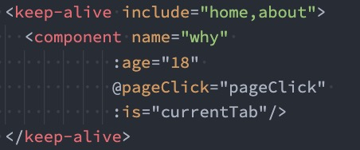

# vue3组件化开发（一）

## 一、**组件的嵌套与拆分**

**前面我们是将所有的逻辑放到一个App.vue中：** 

在之前的案例中，我们只是创建了一个组件App； 如果我们一个应用程序将所有的逻辑都放在一个组件中，那么这个组件就会变成非常的臃肿和难以维护 

所以**组件化的核心思想应该是对组件进行拆分，拆分成一个个小的组件**； **再将这些组件组合嵌套在一起，最终形成我们的应用程序** 

我们来分析一下下面代码的嵌套逻辑，假如我们将所有的代码逻辑都放到一个App.vue组件中： 我们会发现，将所有的代码逻辑全部放到一个组件中，代码是非常的臃肿和难以维护的。 并且在真实开发中，我们会有更多的内容和代码逻辑，对于扩展性和可维护性来说都是非常差的。 所以，在真实的开发中，我们会对组件进行拆分，拆分成一个个功能的小组件


**组件的拆分**

我们可以按照如下的方式进行拆分： 


按照如上的拆分方式后，我们开发对应的逻辑只需要去对应的组件编写就可

## 二、**组件的通信**

**上面的嵌套逻辑如下，它们存在如下关系：** 

App组件是Header、Main、Footer组件的父组件，Main组件是Banner、ProductList组件的父组件

在开发过程中，我们会经常遇到需要**组件之间相互进行通信**： 

比如App可能使用了多个Header，每个地方的Header展示的内容不同，那么我们就需要使用者传递给Header一些数据，让其进行展示； 又比如我们在Main中一次性请求了Banner数据和ProductList数据，那么就需要传递给它们来进行展示； 

也可能是子组件中发生了事件，需要由父组件来完成某些操作，那就需要子**组件向父组件传递事件**

总之，在一个Vue项目中，组件之间的通信是非常重要的环节

### 2.1 **父子组件之间通信的方式**

**父子组件之间如何进行通信呢？** 

父组件传递给子组件：**<span style='color:red'>通过props属性</span>**

子组件传递给父组件：**<span style='color:red'>通过$emit触发事件</span>**


#### 2.1.1 **父组件传递给子组件**

在开发中很常见的就是**父子组件之间通信**，比如父组件有一些数据，需要子组件来进行展示： 这个时候我们可以通过props来完成组件之间的通信

**什么是Props呢？** 

**Props是你可以在组件上注册一些自定义的attribute**； **父组件给这些attribute赋值，子组件通过attribute的名称获取到对应的值** 

**Props有两种常见的用法：** 

方式一：**字符串数组**，数组中的字符串就是attribute的名称

方式二：**对象类型**，对象类型我们可以在指定attribute名称的同时，指定它需要传递的类型、是否是必须的、默认值等等

#### 2.1.2 **Props的数组用法**


#### 2.1.3 **Props的对象用法**

数组用法中我们**只能说明传入的attribute的名称**，并**不能对其进行任何形式的限制**，接下来我们来看一下**对象的写法**是如何让我们的props变得更加完善的。 

**当使用对象语法的时候，我们可以对传入的内容限制更多：** 

指定传入的**attribute的类型**

指定传入的**attribute是否是必传的**

指定**没有传入时，attribute的默认值**

```javascript
export default {
  props: {
     title: String,
     content: {
        type: String,
         required: true,
         default: '哈哈'
     }
  }
}
```

**细节一：那么type的类型都可以是哪些呢？**

String     Number   Object   Function   Symbol   Array   Boolean   Date

**细节二：对象类型的其他写法**

```javascript
export default {
  props: {
      message: String,
      propA: Number,
      // 多个可能的类型
      propB: [String, Number],
      // 必传的字符串
      propC: {
        type: String,
        required: true
      },
      // 带有默认的数字
      propD: {
        type: Number,
        default: 100
      },
      // 带有默认的对象
      propE: {
        type: Object,
       // 对象或数组的默认值必须从一个工厂函数中获取
        default() {
           return { message: 'hello' }
        }
      },            
      // 自定义函数类型
      propF: {
        validator(value) {
           // 这个值必须匹配下面字符串中的一个
           return ['scssecc', 'waring', 'danger'].includes(value)
        }
      }
      // 具有默认值的函数
      propG: {
				type: Function,
         // 与对象或数组的值不同，这不是一个工厂函数，这是一个用作默认值的函数
         default() {
 					return 'Default function'
				}
  		}               
  }
}
```

**细节三：Prop 的大小写命名**

**Prop 的大小写命名(camelCase vs kebab-case)** 

HTML 中的 attribute 名是大小写不敏感的，所以**浏览器会把所有大写字符解释为小写字符**； 这意味着当你使用 DOM 中的模板时，**camelCase (驼峰命名法) 的 prop 名需要使用其等价的 kebab-case (短横线分隔命名) 命名**


#### 2.1.4 **非Prop的Attribute**

**什么是非Prop的Attribute呢？** 

当我们传递给一个组件某个属性，但是该属性<span style='color:red'>并没有定义对应的props或者emits时</span>，就称之为 **非Prop的Attribute**； 

常见的包括**class**、**style**、**id**属性等

**Attribute继承** 

**当组件有单个根节点时，非Prop的Attribute将自动添加到根节点的Attribute中**：


#### 2.1.5 **禁用Attribute继承和多根节点**

如果我们**不希望组件的根元素继承attribute**，可以在组件中设置 **inheritAttrs: false**： 禁用attribute继承的常见情况是需要**将attribute应用于根元素之外的其他元素**； 我们可以通过 **$attrs来访问所有的 非props的attribute**

**多个根节点的attribute**

**多个根节点的attribute如果没有显示的绑定，那么会报警告，我们必须手动的指定要绑定到哪一个属性上**：

```javascript
<div>
  我是NotPropAttribute组件
<h2 :class="$attrs.class"></h2>
</div>

<template>
	<div :class="$attrs.class">我是NotPropAttribute1组件</div>
	<div>我是NotPropAttribute2组件</div>
	<div>我是NotPropAttribute3组件</div>
</template>
```

#### 2.1.6 **子组件传递给父组件**

**什么情况下子组件需要传递内容到父组件呢？** 

当子组件**有一些事件发生的时候**，比如在**组件中发生了点击**，**父组件需要切换内容**； 子组件有**一些内容想要传递给父组件**的时候； 

**我们如何完成上面的操作呢？** 

首先，我们需要在**子组件中定义好在某些情况下触发的事件名称**； 其次，在父组件中以**v-on的方式传入要监听的事件名称，并且绑定到对应的方法中**； 最后，在子组件中发生某个事件的时候，根据事件名称触发对应的事件

#### 2.1.7 **自定义事件的流程**

我们封装一个CounterOperation.vue的组件： 

内部其实是监听两个按钮的点击，点击之后通过 this.$emit的方式发出去事件


#### 2.1.8 **自定义事件的参数和验证**

自定义事件的时候，我们也可以传递一些参数给父组件： 

```javascript
incrementTen() {
  this.$emit('addTen', 10)
}
```

在vue3当中，我们可以对传递的参数进行验证：

```javascript
emits: {
  addOne: null,
  subOne: null,
  addTen:function(payload) {
     if(payload === 10) {
        return true
     }
      return false
  }
}
```

### 2.2 **非父子组件的通信**

在开发中，我们构建了组件树之后，除了**父子组件之间的通信**之外，还会有**非父子组件之间**的通信。 

**这里我们主要讲两种方式：** 

**Provide/Inject**

**Mitt全局事件总线**

#### 2.2.1 **Provide和Inject**

Provide/Inject用于**非父子组件之间共享数据**： 

比如有一些**深度嵌套的组件**，子组件想要获取父组件的部分内容； 在这种情况下，如果我们仍然将props沿着组件链逐级传递下去，就会非常的麻烦； 对于这种情况下，**我们可以使用 Provide 和 Inject ：** 

**无论层级结构有多深，父组件都可以作为其所有子组件的依赖提供者**

父组件有一个 **provide 选项来提供数据**； 子组件有一个 **inject 选项来开始使用这些数据**； 实际上，你可以将依赖注入看作是“**long range props”**，除了： 父组件不需要知道哪些子组件使用它 provide 的 property ，子组件不需要知道 inject 的 property 来自哪里


#### 2.2.2 **Provide和Inject基本使用**

我们开发一个这样的结构：


#### 2.2.3 **Provide和Inject函数的写法**

如果Provide中提供的一些数据是**来自data**，那么我们可能会想要**通过this来获取**： 

**这个时候会报错：**

我们的this使用的是哪里的?


#### 2.2.4 **处理响应式数据**

我们先来验证一个结果：**如果我们修改了this.names的内容，那么使用length的子组件会不会是响应式的？** 

我们会发现对应的子组件中是**没有反应的**： 这是因为当我们修改了names之后，之前在provide中引入的 **this.names.length 本身并不是响应式**的

**那么怎么样可以让我们的数据变成响应式的呢？** 

我们可以**使用响应式的一些API来完成这些功能，比如说computed函数**

**注意：我们在使用length的时候需要获取其中的value** 

这是因为**computed返回的是一个ref对象，需要取出其中的value来使用**


### 2.3 **全局事件总线mitt库**

Vue3从实例中移除了 **$on、$off 和 $once 方法**，所以我们如果希望**继续使用全局事件总线，要通过第三方的库**： 

Vue3官方有推荐一些库，例如 **mitt** 或 **tiny-emitter**； 这里我们主要讲解一下mitt库的使用； 

首先，我们需要先安装这个库：

**<span style='color:red'>npm install mitt</span>**

其次，我们可以封装一个工具eventbus.js：

```javascript
import mitt from 'mitt'

const emitter = mitt()
export default emitter
```

#### 2.3.1 **使用事件总线工具**

**在项目中可以使用它们：** 

我们在Home.vue中监听事件； 在App.vue中触发事件


#### 2.3.2 **Mitt的事件取消**

在某些情况下我们可能希望**取消掉之前注册的函数监听**：

```javascript
// 取消emitter中所有的监听
emitter.all.clear()

// 定义一个函数
function onFoo() {}
emitter.on('foo', onFoo)   // 开启监听
emitter.off('foo', onFoo)  // 取消监听
```

## 三、**插槽Slot**

**在开发中，我们会经常封装一个个可复用的组件：** 

前面我们会通过props传递给组件一些数据，让组件来进行展示； 但是**为了让这个组件具备更强的通用性，我们不能将组件中的内容限制为固定的div、span等等这些元素**； 比如某种情况下我们使用组件，希望**组件显示的是一个按钮**，某种情况下我们**使用组件希望显示的是一张图片**； 我们**应该让使用者可以决定某一块区域到底存放什么内容和元素**

**举个栗子：假如我们定制一个通用的导航组件 - NavBar** 

这个组件分成三块区域：左边-中间-右边，每块区域的内容是不固定； 左边区域可能显示一个菜单图标，也可能显示一个返回按钮，可能什么都不显示； 中间区域可能显示一个搜索框，也可能是一个列表，也可能是一个标题，等等； 右边可能是一个文字，也可能是一个图标，也可能什么都不显示


### 3.1 **如何使用插槽slot？**

**这个时候我们就可以来定义插槽slot：** 

插槽的使用过程其实是**抽取共性、预留不同**； 我们会将**共同的元素、内容依然在组件内进行封装**； 同时会**将不同的元素使用slot作为占位，让外部决定到底显示什么样的元素** 

**如何使用slot呢？** 

Vue中将 <slot> 元素作为**承载分发内容的出口**

在封装组件中，使用特殊的元素<slot>就可以**为封装组件开启一个插槽**； **该插槽插入什么内容取决于父组件如何使用**

### 3.2 **插槽的基本使用**

我们一个组件MySlotCpn.vue：该组件中有一个插槽，我们可以在插槽中放入需要显示的内容； 我们在App.vue中使用它们：我们可以插入普通的内容、html元素、组件元素，都可以是可以的


### 3.3 **插槽的默认内容**

有时候我们希望在使用插槽时，如果**没有插入对应的内容，那么我们需要显示一个默认的内容**： 

当然这个默认的内容**只会在没有提供插入的内容时，才会显示**


### 3.4 **多个插槽的效果**

我们先测试一个知识点：如果一个组件中**含有多个插槽，我们插入多个内容时是什么效果？** 

我们会发现默认情况下**每个插槽都会获取到我们插入的内容来显示**


### 3.5 **具名插槽的使用**

事实上，我们希望达到的效果是插槽对应的显示，这个时候我们就可以使用 **具名插槽：** 

具名插槽顾名思义就是给插槽起一个名字，<slot> 元素有一个特殊的 attribute：name

**一个不带 name 的slot，会带有隐含的名字 default**


### 3.6 **动态插槽名**

**什么是动态插槽名呢？** 

目前我们使用的插槽名称都是固定的； 比如 v-slot:left、v-slot:center等等； 我们可以通过 **v-slot:[dynamicSlotName]方式动态绑定一个名称**


### 3.7 **具名插槽使用的时候缩写**

**具名插槽使用的时候缩写：** 

跟 v-on 和 v-bind 一样，v-slot 也有缩写； 即把参数之前的所有内容 (**v-slot:) 替换为字符 #**


### 3.8 **渲染作用域**

**在Vue中有渲染作用域的概念：** 

**父级模板里的所有内容都是在父级作用域中编译的； 子模板里的所有内容都是在子作用域中编译的**

如何理解这句话呢？我们来看一个案例： 

在我们的案例中ChildCpn自然是可以让问自己作用域中的title内容的； 但是在App中，是访问不了ChildCpn中的内容的，因为它们是跨作用域的访问


### 3.9 **认识作用域插槽**

但是有时候我们希望插槽**可以访问到子组件中的内容**是非常重要的： 

**当一个组件被用来渲染一个数组元素时，我们使用插槽，并且希望插槽中没有显示每项的内容； 这个Vue给我们提供了作用域插槽**

**我们来看下面的一个案例：** 

1.在App.vue中定义好数据 

2.传递给ShowNames组件中 

3.ShowNames组件中遍历names数据 

4.定义插槽的prop 

5.通过v-slot:default的方式获取到slot的props 

6.使用slotProps中的item和index


### 3.10 **独占默认插槽的缩写**

**如果我们的插槽是默认插槽default，那么在使用的时候 v-slot:default="slotProps"可以简写为v-slot="slotProps"：** 


并且如果我们的**插槽只有默认插槽时**，**组件的标签可以被当做插槽的模板来使用**，这样，我们就可以将 v-slot 直 

接用在组件上：


### 3.11 **默认插槽和具名插槽混合**

但是，如果我们有默认插槽和具名插槽，那么按照完整的template来编写。只要出现多个插槽，请始终为所有的插槽使用完整的基于 <template> 的语法：


## 四、**动态组件的实现**

**动态组件是使用 component 组件，通过一个特殊的attribute is 来实现：**


**这个currentTab的值需要是什么内容呢？** 

**可以是通过component函数注册的组件； 在一个组件对象的components对象中注册的组件**

### 4.1 **动态组件的传值**

**如果是动态组件我们可以给它们传值和监听事件吗？** 

可以，**只是我们需要将属性和监听事件放到component上来使用**


## 五、**keep-alive**

### 5.1 **认识keep-alive**

**我们先对之前的案例中About组件进行改造：** 

在其中增加了一个按钮，点击可以递增的功能； 


比如我们将counter点到10，那么在切换到home再切换回来about时，**状态是否可以保持呢？** 

答案是否定的

这是因为默认情况下，**我们在切换组件后，about组件会被销毁掉，再次回来时会重新创建组件**

但是，在开发中某些情况我们希望继续保持组件的状态，而不是销毁掉，这个时候我们就可以**使用一个内置组件：** 

**keep-alive**



### 5.2 **keep-alive属性**

**keep-alive有一些属性：** 

**include** - string | RegExp | Array。**只有名称匹配的组件会被缓存** 

**exclude** - string | RegExp | Array。**任何名称匹配的组件都不会被缓存**

**max** - number | string。最多可以缓存多少组件实例，**一旦达到这个数字，那么缓存组件中最近没有被访问的实例会被销毁**

**include 和 exclude prop 允许组件有条件地缓存：** 

二者都可以用逗号分隔字符串、正则表达式或一个数组来表示； **匹配首先检查组件自身的 name 选项**


### 5.3  **缓存组件的生命周期**

对于缓存的组件来说，再次进入时，我们是**不会执行created或者mounted等生命周期函数**的： 

但是有时候我们确实希望监听到何时重新进入到了组件，何时离开了组件； 这个时候我们可以使用**activated** 和 **deactivated** 这两个生命周期钩子函数来监听

