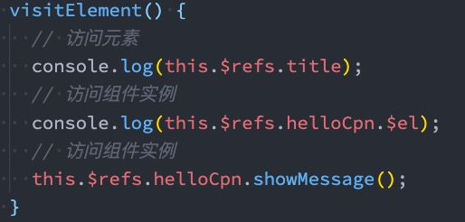
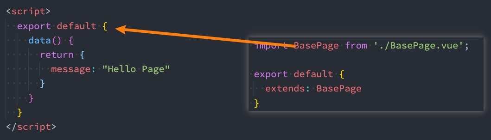

# vue3组件化开发（二）

## **一、Webpack的代码分包**

**默认的打包过程：** 

默认情况下，在构建整个组件树的过程中，因为组件和组件之间是通过模块化直接依赖的，那么webpack在打包时就会将组件模块打包到一起（比如一个app.js文件中）； 这个时候随着项目的不断庞大，app.js文件的内容过大，会造成首屏的渲染速度变慢

**打包时，代码的分包：** 

所以，对于一些不需要立即使用的组件，我们可以单独对它们进行拆分，拆分成一些小的代码块chunk.js； 这些chunk.js会在需要时从服务器加载下来，并且运行代码，显示对应的内容

**那么webpack中如何可以对代码进行分包呢？**


## 二、**Vue中实现异步组件**

如果我们的项目过大了，对于**某些组件**我们希望**通过异步的方式来进行加载**（目的是可以对其进行分包处理），那么Vue中给我们提供了一个函数：**defineAsyncComponent**。 

**defineAsyncComponent接受两种类型的参数：** 

类型一：**工厂函数，该工厂函数需要返回一个Promise对象**

类型二：**接受一个对象类型，对异步函数进行配置**

**工厂函数类型一的写法：**

```javascript
<script>
 import { defineAsyncComponent } from 'vue'

const AsyncHome = defineAsyncComponent(() => import('./AsyncHome.vue')
 export default {
 		components: {
     		AsyncHome                                  
     }        
 }
</script>
```

**异步组件的写法二**

```javascript
const AsyncHome = defineAsyncComponent({
  // 工厂函数
  loader: () => import('./AsyncHome.vue'),
  // 加载过程中显示的组件
  loadingComponent: true,
  // 在显示loadingComponent之前的延迟 | 默认值：200（单位 ms）
  delay: 2000,
  // 如果提供timeout，并且加载组件的时间超过设定值，将显示错误组件
  // 默认值：Infinity（即永不超时，单位 ms）
  timeout: 0,
  // 定义组件是否可挂起 | 默认值 ： true
  suspensible: true
})
```

### 2.1 **异步组件和Suspense**

注意：**目前（2021-06-08）Suspense显示的是一个实验性的特性，API随时可能会修改。** 

**Suspense是一个内置的全局组件，该组件有两个插槽：** 

**default**：如果default可以显示，那么显示default的内容

**fallback**：如果default无法显示，那么会显示fallback插槽的内容


## 三、**$refs的使用**

某些情况下，我们在组件中想要**直接获取到元素对象或者子组件实例**： 

在Vue开发中我们是不推荐进行DOM操作的； 这个时候，我们可以给**元素或者组件绑定一个ref的attribute属性**； 

**组件实例有一个$refs属性：** 

它一个对象**Object**，持有注册过 ref attribute 的所有 DOM 元素和组件实例



## 四、**$parent和$root**

**我们可以通过$parent来访问父元素。** 

HelloWorld.vue的实现： 这里我们也可以通过**$root**来实现，因为App是我们的根组件


注意：在Vue3中已经**移除了$children的属性**，所以不可以使用了

## 五、**生命周期**

### 5.1 **认识生命周期**

**什么是生命周期呢？** 

每个组件都可能会经历从创建、挂载、更新、卸载等一系列的过程； 在这个过程中的某一个阶段，用于可能会想要添加一些属于自己的代码逻辑（比如组件创建完后就请求一些服务器数据）； 但是我们如何可以知道目前组件正在哪一个过程呢？Vue给我们提供了组件的生命周期函数

**生命周期函数：** 

生命周期函数是一些**钩子函数**，在某个时间会被**Vue源码内部进行回调**； 通过对生命周期函数的回调，我们可以知道目前组件正在经历什么阶段； 那么我们就可以在该生命周期中编写属于自己的逻辑代码了

### 5.2 **生命周期的流程**


## 六、**组件的v-model**

**前面我们在input中可以使用v-model来完成双向绑定：** 

这个时候往往会非常方便，因为v-model默认帮助我们完成了两件事； 

**v-bind:**value的数据绑定和**@input**的事件监听

如果我们现在**封装了一个组件**，其他地方在使用这个组件时，是否也可以**使用v-model来同时完成这两个功能**呢？ 

也是可以的，vue也支持在组件上使用v-model；  **当我们在组件上使用的时候，等价于如下的操作：** 

我们会发现和input元素不同的只是属性的名称和事件触发的名称而已

```javascript
<my-input v-model="message"/>
  // 等价于
<my-input :model-value="message" @update:model-value="message = $event" />
```

### 6.1 **组件v-model的实现**

**那么，为了我们的MyInput组件可以正常的工作，这个组件内的 <input> 必须：** 

将其 value attribute 绑定到一个名叫 **modelValue 的 prop 上**

在其 input 事件被触发时，**将新的值通过自定义的 update:modelValue 事件抛出**

MyInput.vue的组件代码如下：


### 6.2 **computed实现**

我们依然希望在组件内部按照双向绑定的做法去完成，应该如何操作呢？**我们可以使用计算属性的setter和getter** 

**来完成**


### 6.3 **绑定多个属性**

我们现在通过v-model是直接绑定了一个属性，如果我们**希望绑定多个属性**呢？ 

也就是我们希望在一个组件上使用多个v-model是否可以实现呢？ 

默认情况下的v-model其实是绑定了 modelValue 属性和 @update:modelValue的事件

如果我们希望绑定更多，可以给**v-model传入一个参数，那么这个参数的名称就是我们绑定属性的名称**

注意：这里我是绑定了两个属性的

```javascript
<my-input  v-model="message" v-model:title="title" />
```

**v-model:title相当于做了两件事：** 

绑定了title属性

监听了 @update:title的事件


## 七、**Mixin**

### 7.1 **认识Mixin**

目前我们是使用组件化的方式在开发整个Vue的应用程序，但是**组件和组件之间有时候会存在相同的代码逻辑**，我们希望对**相同的代码逻辑进行抽取**。 

在Vue2和Vue3中都支持的一种方式就是**使用Mixin来完成**： 

Mixin提供了一种非常灵活的方式，来分发**Vue组件中的可复用功能**

**一个Mixin对象可以包含任何组件选项；当组件使用Mixin对象时，所有Mixin对象的选项将被 混合 进入该组件本身的选中**

### 7.2 **Mixin的基本使用**


### 7.3 **Mixin的合并规则**

**如果Mixin对象中的选项和组件对象中的选项发生了冲突，那么Vue会如何操作呢？** 

这里分成不同的情况来进行处理：

**情况一：如果是data函数的返回值对象** 

返回值对象默认情况下会**进行合并**； 如果data返回值对象的属性发生了冲突，那么会**保留组件自身的数据**

**情况二：如何生命周期钩子函数** 

**生命周期的钩子函数会被合并到数组中，都会被调用**

**情况三：值为对象的选项，例如 methods、components 和 directives，将被合并为同一个对象。** 

比如都有methods选项，并且都定义了方法，那么它们都会生效； 但是**如果对象的key相同，那么会取组件对象的键值对**

### 7.4 **全局混入Mixin**

**如果组件中的某些选项，是所有的组件都需要拥有的，那么这个时候我们可以使用全局的mixin**

全局的Mixin可以使用 **应用app的方法 mixin 来完成注册**； **一旦注册，那么全局混入的选项将会影响每一个组件**


## 八、**extends**

另外一个类似于Mixin的方式是**通过extends属性**

允许声明扩展另外一个组件，类似于Mixins



在开发中**extends用的非常少**，在Vue2中比较**推荐大家使用Mixin**，而在Vue3中**推荐使用Composition API**

