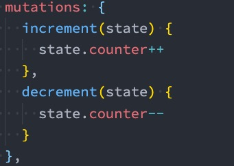
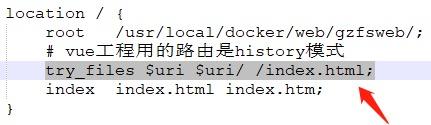

# Vuex状态管理

## 一、**状态管理**

### 1.1 **什么是状态管理**

在开发中，我们会的应用程序需要处理各种各样的数据，这些数据需要保存在我们应用程序中的某一个位置，对于这些数据的管理我们就称之为是 **状态管理**。 

在前面我们是如何管理自己的状态呢？ 

在Vue开发中，我们使用**组件化的开发方式**； 而在组件中我们定义**data**或者在**setup**中返回使用的数据， 

这些数据我们称之为**state**； 在模块**template**中我们可以使用这些数据，模块最终会被**渲染成DOM，我们称之为View**； 

在模块中我们会产生一些**行为事件**，处理这些行为事件时，有可能**会修改state，这些行为事件我们称之为actions**


### 1.2 **复杂的状态管理**

JavaScript开发的应用程序，已经变得越来越复杂了： JavaScript需要管理的状态越来越多，越来越复杂； 这些状态包括**服务器返回的数据、缓存数据、用户操作产生的数据**等等； 也包括一些**UI的状态**，比如某些**元素是否被选中**，是否**显示加载动效，当前分页**； 当我们的应用遇到**多个组件共享状态**时，**单向数据流的简洁性很容易被破坏**： **多个视图依赖于同一状态； 来自不同视图的行为需要变更同一状态**

我们是否可以通过组件数据的传递来完成呢？ 

对于一些简单的状态，确实可以通过**props**的传递或者**Provide**的方式来共享状态

但是对于复杂的状态管理来说，显然单纯通过传递和共享的方式是不足以解决问题的，比如兄弟组件如何共享数据呢？

## 二、**Vuex的状态管理**

管理不断变化的state本身是非常困难的： **状态之间相互会存在依赖，一个状态的变化会引起另一个状态的变化，View页面也有可能会引起状态的变化**； 当应用程序复杂时，state在什么时候，因为什么原因而发生了变化，发生了怎么样的变化，**会变得非常难以控制和追踪**； 因此，我们是否可以考虑将**组件的内部状态抽离出来**，以**一个全局单例的方式**来管理呢？ 

在这种模式下，我们的**组件树构成了一个巨大的 “视图View”**； 不管在树的哪个位置，**任何组件都能获取状态或者触发行为**； 通过定义和隔离状态管理中的各个概念，并通过强制性的规则来维护视图和状态间的独立性，我们的代码边会变得更加结构化和易于维护、跟踪； 这就是Vuex背后的基本思想，它借鉴了**Flux、Redux、Elm**（纯函数语言，redux有借鉴它的思想）：


### 2.1 **Vuex的安装**

要使用vuex，首先第一步需要安装vuex： 我们这里使用的是vuex4.x，安装的时候需要添加 next 指定版本

**<span style='color:red'>npm install vuex@next</span>**

### 2.2 **创建Store**

每一个**Vuex应用的核心就是store**（仓库）： store本质上是一个容器，它包含着你的应用中大部分的状态（state）

**Vuex和单纯的全局对象有什么区别呢？** 

第一：**Vuex的状态存储是响应式的** ，当Vue组件从store中读取状态的时候，若store中的状态发生变化，那么相应的组件也会被更新

第二：你**不能直接改变store中的状态** ，改变store中的状态的唯一途径就显示**提交 (commit) mutation**； 这样使得我们可以方便的跟踪每一个状态的变化，从而让我们能够通过一些工具帮助我们更好的管理应用的状态

使用步骤： 

创建Store对象

在app中通过插件安装

### 2.3 **组件中使用store**

在组件中使用store，我们按照如下的方式： 

**在模板中使用**

**在options api中使用，比如computed**

**在setup中使用**

### 2.4 **单一状态树**

Vuex 使用**单一状态树**： 

用一个对象就包含了全部的应用层级状； 采用的是**SSOT**，Single Source of Truth，也可以翻译成**单一数据源**； 

这也意味着，**每个应用将仅仅包含一个 store 实例**； 单状态树和模块化并不冲突 

单一状态树的优势： 

如果你的状态信息是保存到多个Store对象中的，那么之后的管理和维护等等都会变得特别困难； 所以V**uex也使用了单一状态树来管理应用层级的全部状态**； **单一状态树能够让我们最直接的方式找到某个状态的片段**，而且在之后的维护和调试过程中，也可以非常方便的管理和维护

### 2.5 **组件获取状态**

**可以使用计算属性：**

```javascript
computed: {
  counter() {
     return this.$store.state.counter
  }
}
```

但是，如果我们**有很多个状态都需要获取**话，可以使用**mapState的辅助函数**： 

**mapState的方式一：对象类型**

**mapState的方式二：数组类型**

**也可以使用展开运算符和来原有的computed混合在一起**

### 2.6 **在setup中使用mapState**

在setup中如果我们单个获取装是非常简单的： 通过**useStore拿到store**后去获取某个状态即可； 但是如果我们需要使用 mapState 的功能呢？ 

默认情况下，**Vuex并没有提供非常方便的使用mapState的方式，这里我们进行了一个函数的封装**：


### 2.7 **getters的基本使用**

某些属性我们可能需要警告变化后来使用，这个时候可以使用getters：


```javascript
<div>
  <h2>{{$store.getters.totalPrice}}</h2>
</div>
```

### 2.8 **getters第二个参数**

 getters可以接收第二个参数：**接受其他的getters**


### 2.9 **getters的返回函数**

getters中的函数本身，可以返回一个函数，那么在使用的地方相当于可以调用这个函数：


### 2.10 **mapGetters辅助函数**

我们也可以使用mapGetters的辅助函数


在setup中使用


### 2.11 **Mutation基本使用**

**更改 Vuex 的 store 中的状态的唯一方法是提交 mutation：**



### 2.12 **Mutation携带数据**

很多时候我们在提交mutation的时候，会携带一些数据，这个时候我们可以使用参数：

```javascript
mutations: {
  add(state, payload) {
      state.counter+=payload
  }
}
```

**payload为对象类型**

```javascript
mutations: {
  add(state, payload) {
      state.counter+=payload.count
  }
}
```

**对象风格的提交方式**

```javascript
$store.commit({
  type: 'add',
  count: 100
})
```

### 2.13 **Mutation常量类型**

定义常量：mutation-type.js

```javascript
export const ADD_NUMBER = 'ADD_NUMBER'
```

定义mutation

```javascript
mutations: {
  [ADD_NUMBER](state, payload) {
      state.counter += payload.count
  }
}
```

提交mutation

```javascript
$store.commit({
  type: ADD_NUMBER,
  count: 100
})
```

### 2.14 **mapMutations辅助函数**

我们也可以借助于辅助函数，帮助我们快速映射到对应的方法中：


在setup中使用也是一样的：


### 2.15 **mutation重要原则**

一条重要的原则就是要记住 **mutation 必须是同步函数** 

这是因为**devtool工具会记录mutation的日记**； **每一条mutation被记录，devtools都需要捕捉到前一状态和后一状态的快照； 但是在mutation中执行异步操作，就无法追踪到数据的变化**； 所以Vuex的重要原则中要求 mutation必须是同步函数

### 2.16 **actions的基本使用**

action类似于mutation，不同在于： **action提交的是mutation，而不是直接变更状态**； **action可以包含任意异步操作**； 

这里有一个非常重要的参数**context**： **context是一个和store实例均有相同方法和属性的context对象**； 

所以我们可以**从其中获取到commit方法来提交一个mutation**，或者**通过 context.state 和 context.getters 来获取 state 和 getters**

### 2.17 **actions的分发操作**

如何使用action进行action的分发： 

**分发使用的是 store 上的dispatch函数**

```javascript
add() {
  this.$store.dispatch('add')
  // 携带参数
   this.$store.dispatch('add', {count: 100})
  // 以对象的形式进行分发
  his.$store.dispatch({
      type: 'add',
      count: 100
  })
}
```

### 2.18 **mapActions辅助函数**

action也有对应的辅助函数： 

对象类型的写法； 

数组类型的写法


### 2.19 **actions的异步操作**

Action 通常是异步的，那么如何知道 action 什么时候结束呢？ 

我们可以**通过让action返回Promise，在Promise的then中来处理完成后的操作**


### 2.20 **module的基本使用**

什么是Module？ 

由于使用单一状态树，应用的所有状态会集中到一个比较大的对象，当应用变得非常复杂时，store 对象就有可能变得相当臃肿； 为了解决以上问题，Vuex 允许我们将 store 分割成**模块（module）**

**每个模块拥有自己的 state、mutation、action、getter、甚至是嵌套子模块**


### 2.21 **module的局部状态**

对于模块内部的 mutation 和 getter，接收的第一个参数是**模块的局部状态对象**：


### 2.22 **module的命名空间**

默认情况下，模块内部的action和mutation仍然是注册在**全局的命名空间**中的： 这样使得多个模块能够对同一个 action 或 mutation 作出响应； **Getter 同样也默认注册在全局命名空间**； 如果我们希望模块具有更高的封装度和复用性，可以添加 **namespaced: true** 的方式使其成为带命名空间的模块： 当模块被注册后，它的所有 **getter、action 及 mutation 都会自动根据模块注册的路径调整命名**


### 2.23 **module修改或派发根组件**

如果我们希望在action中修改root中的state，那么有如下的方式：


### 2.24 **module的辅助函数**

辅助函数有三种使用方法： 

方式一：通过完整的模块空间名称来查找

方式二：第一个参数传入模块空间名称，后面写上要使用的属性 

方式三：通过 createNamespacedHelpers 生成一个模块的辅助函数


### 2.25 **对useState和useGetters修改**


## 三、**nexttick**

官方解释：**将回调推迟到下一个 DOM 更新周期之后执行。在更改了一些数据以等待 DOM 更新后立即使用它**。 

## 四、**historyApiFallback**

historyApiFallback是开发中一个非常常见的属性，它主要的作用是**解决SPA页面在路由跳转之后，进行页面刷新时，返回404的错误**。 

**boolean值：默认是false** 

如**果设置为true，那么在刷新时，返回404错误时，会自动返回 index.html 的内容**

**object类型的值，可以配置rewrites属性**

可以**配置from来匹配路径，决定要跳转到哪一个页面**； 事实上devServer中实现historyApiFallback功能是通过connect-history-api-fallback库的： 可以查看文档：

[]: connect-history-api-fallback

