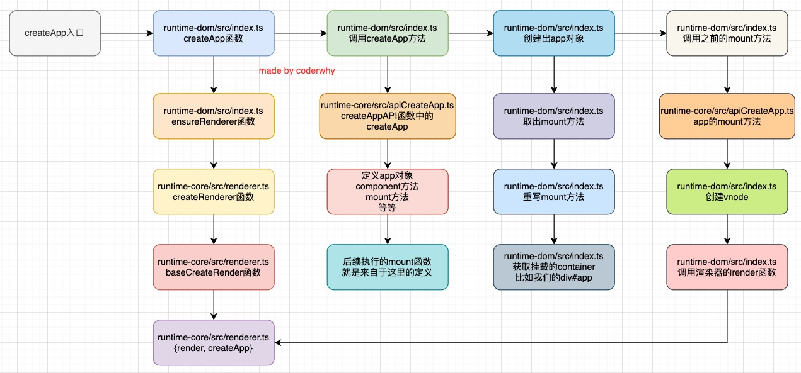

# Vue3源码

## 一、**真实的DOM渲染**

我们传统的前端开发中，我们是编写自己的HTML，最终被渲染到浏览器上的，那么它是什么样的过程呢？

## 二、**虚拟DOM的优势**

**目前框架都会引入虚拟DOM来对真实的DOM进行抽象，这样做有很多的好处：**

首先是可以**对真实的元素节点进行抽象，抽象成VNode（虚拟节点），这样方便后续对其进行各种操作**： 

**因为对于直接操作DOM来说是有很多的限制的，比如diff、clone等等，但是使用JavaScript编程语言来操作这些，就变得非常的简单**，我们可以**使用JavaScript来表达非常多的逻辑，而对于DOM本身来说是非常不方便的**

其次是**方便实现跨平台，包括你可以将VNode节点渲染成任意你想要的节点** ：如渲染在canvas、WebGL、SSR、Native（iOS、Android）上； 并且**Vue允许你开发属于自己的渲染器（renderer），在其他的平台上渲染**

### 2.1 **虚拟DOM的渲染过程**

## 三、**三大核心系统**

事实上Vue的源码包含三大核心：

**Compiler模块**：编译模板系统

**Runtime模块**：也可以称之为Renderer模块，真正渲染的模块

**Reactivity模块**：响应式系统

### 3.1 **三大系统协同工作**

### 3.2 **实现Mini-Vue**

实现一个简洁版的Mini-Vue框架，该Vue包括三个模块： 

渲染系统模块

可响应式系统模块

应用程序入口模块

### 3.3 **渲染系统实现**

**渲染系统**，该模块主要包含三个功能： 

功能一：h函数，用于返回一个VNode对象

功能二：mount函数，用于将VNode挂载到DOM上

功能三：patch函数，用于对两个VNode进行对比，决定如何处理新的VNode

### 3.4 **h函数 – 生成VNode**

h函数的实现： 

直接返回一个VNode对象即可

### 3.5 **Mount函数 – 挂载VNode**

**mount函数的实现：** 

第一步：根据tag，创建HTML元素，并且存储到vnode的el中

第二步：处理props属性 

如果以on开头，那么监听事件； 普通属性直接通过 setAttribute 添加即可

第三步：处理子节点 

如果是字符串节点，那么直接设置 textContent； 如果是数组节点，那么遍历调用 mount 函数

### 3.6 **Patch函数 – 对比两个VNode**

patch函数的实现，分为两种情况 

**n1和n2是不同类型的节点**： 

找到n1的el父节点，删除原来的n1节点的el； 挂载n2节点到n1的el父节点上

**n1和n2节点是相同的节点：** 

处理props的情况 

先将新节点的props全部挂载到el上； 判断旧节点的props是否不需要在新节点上，如果不需要，那么删除对应的属性

处理children的情况

如果新节点是一个字符串类型，那么直接调用 el.textContent = newChildren； 如果新节点不同一个字符串类型： 

旧节点是一个字符串类型 

将el的textContent设置为空字符串； 就节点是一个字符串类型，那么直接遍历新节点，挂载到el上

旧节点也是一个数组类型 

取出数组的最小长度； 遍历所有的节点，新节点和旧节点进行path操作； 如果新节点的length更长，那么剩余的新节点进行挂载操作； 如果旧节点的length更长，那么剩余的旧节点进行卸载操作

### 3.7 **依赖收集系统**

### 3.8 **响应式系统Vue2实现**

### 3.9 **响应式系统Vue3实现**

### 3.10 **为什么Vue3选择Proxy呢？**

**Object.definedProperty** 是**劫持对象的属性**时，如果新增元素： 

那么**Vue2需要再次 调用definedProperty**，而 Proxy 劫持的是整个对象，不需要做特殊处理； 

修改对象的不同： 

**使用 defineProperty 时，我们修改原来的 obj 对象就可以触发拦截**； 而使用 **proxy，就必须修改代理对象**，即 Proxy 的实例才可以触发拦截

Proxy 能观察的类型比 defineProperty 更丰富 

has：in操作符的捕获器

deleteProperty：delete 操作符的捕捉器； 等等其他操作

Proxy 作为新标准将受到浏览器厂商重点持续的性能优化； 缺点：Proxy 不兼容IE，也没有 polyfill, defineProperty 能支持到IE9

## 四、**框架外层API设计**

这样我们就知道了，从框架的层面来说，我们需要有两部分内容： 

**createApp用于创建一个app对象； 该app对象有一个mount方法，可以将根组件挂载到某一个dom元素上**

## 五、**源码阅读**

### 5.1 **createApp**

### 5.2 **挂载根组件**

### 5.3 **组件化的初始化**

### 5.4 **Compile过程**

### 5.5 **Block Tree分析**

### 5.6 **生命周期回调**

### 5.7 **template中数据的使用顺序**

