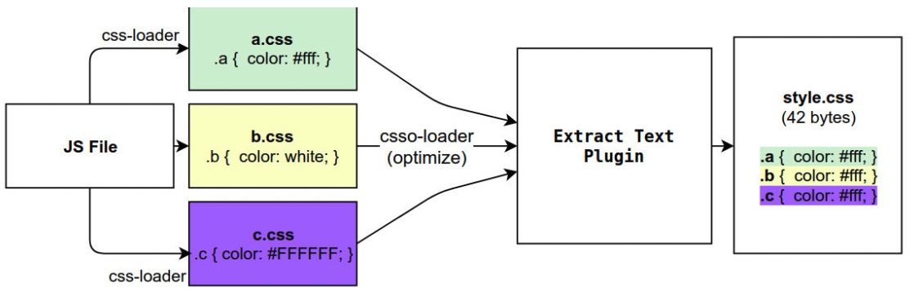
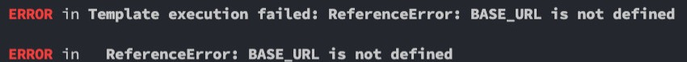

# webpack打包其他资源

## 一、**webpack中的loaders**

### 1.1 **css-loader**

#### 1.1.1 **css-loader的使用**

loader 可以用于对模块的源代码进行转换； 

我们可以将**css文件也看成是一个模块**，我们是**通过import来加载这个模块**的； 在加载这个模块时，webpack其实并不知道如何对其进行加载，我们**必须制定对应的loader**来完成这个功能； 

那么我们需要一个什么样的loader呢？ 

对于加载css文件来说，我们需要一个可以读取css文件的loader； 这个loader最常用的是css-loader

**css-loader的安装：**

**<span style='color:red'>npm install css-loader -D</span>**

#### 1.1.2 **css-loader的使用方案**

**如何使用这个loader来加载css文件呢？有三种方式：** 

内联方式 

CLI方式（webpack5中不再使用）

配置方式

**内联方式：**内联方式使用较少，因为不方便管理； 在引入的样式前加上使用的loader，并且使用!分割

```javascript
import 'css-loader!.../css/style.css'
```

**CLI方式** 

在webpack5的文档中已经没有了**--module-bind**，实际应用中也比较少使用，因为不方便管理

#### 1.1.3 **loader配置方式**

配置方式表示的意思是在我们的webpack.config.js文件中写明配置信息： 

**module.rules中允许我们配置多个loader**（因为我们也会继续使用其他的loader，来完成其他文件的加载）； 这种方式可以更好的表示loader的配置，也方便后期的维护，同时也让你对各个Loader有一个全局的概览

**module.rules的配置如下：** 

rules属性对应的值是一个数组：**[Rule]** 

数组中存放的是一个个的Rule，Rule是一个对象，对象中可以设置多个属性： 

**test属性**：用于对 resource（资源）进行匹配的，通常会设置成正则表达式

**use属性**：对应的值时一个数组：**[UseEntry]** 

UseEntry是一个对象，可以通过对象的属性来设置一些其他属性 

**loader**：必须有一个 loader属性，对应的值是一个字符串 

**options**：可选的属性，值是一个字符串或者对象，值会被传入到loader中

**query**：目前已经使用options来替代

**传递字符串（如：use: [ 'style-loader' ]）是 loader 属性的简写方式（如：use: [ { loader: 'style-loader'} ]）；** 

 **loader属性**： Rule.use: [ { loader } ] 的简写

#### 1.1.4 **Loader的配置代码**

```javascript
// 导出配置信息
module.exports = {
  mode: 'development',
  enter: './src/main.js',
  output: {
    filename: 'bundle.js',
    path: path.resolve(__driname, './dist')
  },
  module: {
    rules: [
      {
         test: '/\.css$/',
         // loader: 'css-loader',   写法一
         // use: ['css-loader'], 写法二
         // 写法三
         use: [
              {loader: 'css-loader'}
         ]
      }
    ]
  }
}
```

### 1.2 **style-loader**

我们已经可以通过css-loader来加载css文件了 但是你会发现这个css在我们的代码中并没有生效（页面没有效果）。 

这是为什么呢？ 

因为css-loader只是**负责将.css文件进行解析**，**并不会将解析之后的css插入到页面中**； 如果我们希望再完成插入style的操作，那么我们还需要另外一个loader，就是**style-loader**

**安装style-loader：**

**<span style='color:red'>npm install style-loader -D</span>**

#### 1.2.1 **配置style-loader**

那么我们应该如何使用style-loader： 

在配置文件中，添加style-loader

**注意：因为loader的执行顺序是从右向左（或者说从下到上，或者说从后到前的），所以我们需要将style-loader写到css-loader的前面**

```javascript
use: [
  {loader: 'style-loader'},
  {loader: 'css-lodaer'}
]
```

重新执行编译npm run build，可以发现打包后的css已经生效了

### 1.3 **less-loader**

#### 1.3.1 **如何处理less文件？**

在我们开发中，我们可能会使用**less、sass、stylus的预处理器来编写css样式**，效率会更高。 那么，如何可以让我们的环境支持这些预处理器呢？ 

首先我们需要确定，less、sass等编写的css需要通过工具转换成普通的css； 比如我们编写如下的less样式：

```javascript
@fontSize: 30px;
@fontWeight: 700;

.content {
  font-size: @fontSize;
  fonw-weight: @fontWeight;
}
```

#### 1.3.2 **Less工具处理**

我们可以使用less工具来完成它的编译转换： 

**<span style='color:red'>npm install less -D</span>**

执行如下命令：

**<span style='color:red'>npx less ./src/css/title.less title.css</span>**

#### 1.3.3 **less-loader处理**

但是在项目中我们会编写大量的css，它们如何可以自动转换呢？ 

这个时候我们就可以使用**less-loader**，来自动使用less工具转换less到css

**<span style='color:red'>npm install less-loader -D</span>**

配置webpack.config.js

```javascript
{
  test: /\.less$/,
  use: {
       {loader: 'style-loader'},
       {loader: 'css-loader'},
       {loader: 'less-loader'}
  }
}
```

执行npm run build ，less就可以自动转换成css，并且页面也会生效了

### 1.4 **PostCSS工具**

#### 1.4.1 **认识PostCSS工具**

什么是PostCSS呢？ 

PostCSS是一个通过JavaScript来转换样式的工具； **这个工具可以帮助我们进行一些CSS的转换和适配，比如自动添加浏览器前缀、css样式的重置**； 但是实现这些功能，我们需要**借助于PostCSS对应的插件**

如何使用PostCSS呢？主要就是两个步骤： 

第一步：查找PostCSS在构建工具中的扩展，比如**webpack中的postcss-loader**

第二步：选择可以添加你需要的**PostCSS相关的插件**

#### 1.4.2 **命令行使用postcss**

当然，我们能不能也直接在终端使用PostCSS呢？ 也是可以的，但是我们需要单独安装一个工具**postcss-cli**

我们可以安装一下它们：**postcss、postcss-cli**

**<span style='color:red'>npm install postcss postcss-cli -D</span>**

我们编写一个需要添加前缀的css：

https://autoprefixer.github.io/

我们可以在上面的网站中查询一些添加css属性的样式

```css
:fullscreen {
  color: red;
}
.content {
  user-select: none;
}
```

#### 1.4.3 **插件autoprefixer**

因为我们需要添加前缀，所以要安装autoprefixer：

**<span style='color:red'>npm install autoprefixer -D</span>**

直接使用使用postcss工具，并且制定使用autoprefixer

**<span style='color:red'>npx postcss --use autoprefixer -o end.css ./src/css/style.css</span>**

转化之后的css样式如下：

```css
:fullscreen {
  color: red;
}
.content {
  -webkit-user-select: none;
     -moz-user-select: none;
      -ms-user-select: none;
          user-select: none;
}
```

#### 1.4.4 **postcss-loader**

真实开发中我们必然不会直接使用命令行工具来对css进行处理，而是可以借助于构建工具： 在webpack中使用postcss就是使用postcss-loader来处理的； 安装postcss-loader：

**<span style='color:red'>npm install postcss-loader -D</span>**

我们修改加载css的loader：

**注意：因为postcss需要有对应的插件才会起效果，所以我们需要配置它的plugin**

```javascript
{
  loader: 'postcss-loader',
  options: {
    postcssOptions: [
       plugins: [
         require('autoprefixer')
    	]
    ]
  }
}
```

#### 1.4.5 **单独的postcss配置文件**

当然，我们也可以将这些配置信息放到一个单独的文件中进行管理： 在根目录下创建**postcss.config.js**

```javascript
module.exports = {
 	plugins: [
    require('autoprefixer')
  ]
}
```

#### 1.4.6 **postcss-preset-env**

事实上，在配置postcss-loader时，我们配置插件并不需要使用autoprefixer。 

我们可以使用另外一个插件：**postcss-preset-env** 

postcss-preset-env也是一个postcss的插件； 它可以帮助我们将一些现代的CSS特性，转成大多数浏览器认识的CSS，并且会根据目标浏览器或者运行时环境添加所需的**polyfill**； 也包括会自动帮助我们添加**autoprefixer**（所以相当于已经内置了autoprefixer）； 首先，我们需要安装postcss-preset-env：

**<span style='color:red'>npm install postcss-preset-env -D</span>**

之后，我们直接修改掉之前的autoprefixer即可：

```javascript
{
  loader: 'postcss-loader',
  options: {
    postcssOptions: [
       plugins: [
         require('postcss-preset-env')
    	]
    ]
  }
}

module.exports = {
  plugins: [
    require('postcss-preset-env')
  ]
}
```

**注意：我们在使用某些postcss插件时，也可以直接传入字符串**

### 1.5 **file-loader**

要处理jpg、png等格式的图片，我们也需要有对应的loader：**file-loader** 

file-loader的作用就是帮助我们处理import/require()方式引入的一个文件资源，并且会将它放到我们输出的文件夹中； 

**安装file-loader：**

**<span style='color:red'>npm install file-loader -D</span>**

配置处理图片的Rule：

```javascript
{
  test: /\.(png|jpe?g|gif|svg)$/i,
  use: { loader: 'file-loader'}
}
```

#### 1.5.1 **文件的命名规则**

有时候我们处理后的文件名称按照一定的规则进行显示： 

比如保留原来的**文件名、扩展名**，同时为了防止重复，包含一个**hash**值等，这个时候我们可以使用**PlaceHolders**来完成，webpack给我们提供了大量的PlaceHolders来显示不同的内容： 

https://webpack.js.org/loaders/file-loader/#placeholders   我们可以在文档中查阅自己需要的placeholder

我们这里介绍几个最常用的placeholder： 

 **[ext]：** 处理文件的扩展名

**[name]：**处理文件的名称

 **[hash]：**文件的内容，使用MD4的散列函数处理，生成的一个128位的hash值（32个十六进制）

**[contentHash]：**在file-loader中和[hash]结果是一致的

 **[hash:<length>]：**截图hash的长度，默认32个字符太长了

**[path]：**文件相对于webpack配置文件的路径

#### 1.5.2 **设置文件的名称**

那么我们可以按照如下的格式编写： 这个也是vue的写法

```javascript
{
  test: /\.(png|jpe?g|gif|svg)$/i,
  use: {
    loader: 'file-loader',
    options: {
      name: 'img/[name].[hash:8].[ext]'
    }
  }
}
```

#### 5.1.3 **设置文件的存放路径**

当然，我们刚才通过 img/ 已经设置了文件夹，这个也是vue、react脚手架中常见的设置方式： 

其实按照这种设置方式就可以了； 

当然我们也可以通过**outputPath**来设置输出的文件夹

```javascript
{
  test: /\.(png|jpe?g|gif|svg)$/i,
  use: {
    loader: 'file-loader',
    options: {
      name: 'img/[name].[hash:8].[ext]',
     	output: 'img'
    }
  }
}
```

### 1.6 **url-loader**

**url-loader和file-loader**的工作方式是相似的，但是可以将较小的文件，转成**<span style='color:red'>base64的URI</span>**

**安装url-loader：**

**<span style='color:red'>npm install url-loader -D</span>**

```javascript
{
  test: /\.(png|jpe?g|gif|svg)$/i,
  use: {
      loader: 'url-loader',
      options: {
         name: 'img/[name].[hash:8].[ext]',
         output: 'img'
      }
  }
}
```

**显示结果是一样的，并且图片可以正常显示**

但是在dist文件夹中，我们会看不到图片文件： 这是因为我的两张图片的大小分别是38kb和295kb； 默认情况下url-loader会将所有的图片文件转成base64编码

#### 1.6.1 **url-loader的limit**

开发中我们往往是**小的图片需要转换，但是大的图片直接使用图片即可** ，这是因为**小的图片转换base64之后可以和页面一起被请求，减少不必要的请求过程； 而大的图片也进行转换，反而会影响页面的请求速度**； 那么，我们如何可以**限制哪些大小的图片转换和不转换**呢？ 

url-loader有一个options属性**limit**，可以用于设置转换的限制； 下面的代码38kb的图片会进行base64编码，而295kb的不会

```javascript
{
  test: /\.(png|jpe?g|gif|svg)$/i,
  use: {
      loader: 'url-loader',
      options: {
         name: 'img/[name].[hash:8].[ext]',
         output: 'img',
         limit: 100 * 1024
      }
  }
}
```

## 二、**asset module type**

### 2.1 **认识asset module type**

**我们当前使用的webpack版本是webpack5：** 

在webpack5之前，加载这些资源我们需要使用一些**loader**，比如raw-loader 、url-loader、file-loader

在webpack5开始，我们可以直接使用**资源模块类型**（asset module type），来替代上面的这些loader

**资源模块类型(asset module type)**，通过添加 4 种新的模块类型，来替换所有这些 loader：

**asset/resource** 发送一个单独的文件并导出 URL。之前通过使用 file-loader 实现

**asset/inline** 导出一个资源的 data URI。之前通过使用 url-loader 实现

**asset/source** 导出资源的源代码。之前通过使用 raw-loader 实现

**asset** 在导出一个 data URI 和发送一个单独的文件之间自动选择。之前通过使用 url-loader，并且配置资源体积限制实现

### 2.2 **asset module type的使用**

比如加载图片，我们可以使用下面的方式：

```javascript
{
  test: /\.(png|jpe?g|gif|svg)$/i,
 	type: 'asset/resource'
}
```

但是，如何可以自定义文件的输出路径和文件名呢？

**方式一：**修改output，添加assetModuleFilename属性

**方式二：**在Rule中，添加一个generator属性，并且设置filename

```javascript
// 方式一
output: {
  filename: 'bundle.js',
  path: path.resolve(__dirname, './dist'),
  assetModuleFilename: 'img/[name].[hash: 6][ext]'
}

// 方式二
{
  test: /\.(png|jpe?g|gif|svg)$/i,
  type: 'asset/resource',
  generator: {
     filename: 'img/[name].[hash:6][ext]'
  }
}
```

### 2.3 **url-loader的limit效果**

我们需要两个步骤来实现： 

**步骤一：**将type修改为asset

**步骤二：**添加一个parser属性，并且制定dataUrl的条件，添加maxSize属性

```javascript
module: {
  rules: [
     {
       test: /\.(png|jpe?g|gif|svg)$/i,
       type: 'asset',
       generator: {
         filename: 'img/[name].[hash:6][ext]'
       },
        parser: {
           dataUrlCondition: {
             maxSize: 100 * 1024
           }
        }
     }
  ]
}
```

## 三、**加载字体文件**

如果我们需要使用**某些特殊的字体或者字体图标**，那么我们会引入很多字体相关的文件，这些文件的处理也是一样的。 

首先，我从阿里图标库中下载了几个字体图标：


在component中引入，并且添加一个i元素用于显示字体图标：

```javascript
const iEl = document.createElement('i')
iEl.className = 'iconfont icon-ashbin'
element.appendChild(iEl)
```

### 3.1 **字体的打包**

这个时候打包会报错，因为无法正确的处理**eot、ttf、woff**等文件： 

我们可以选择使用**file-loader**来处理，也可以选择直接使用**webpack5的资源模块类型**来处理

```javascript
{
  test: /\.(eot|ttf|woff2?)$/,
  type: 'asset/resource',
  generator: {
    filename: 'font/[name].[hash:6][ext]'
  }
}
```

## 四、**webpack中的plugins**

### 4.1 **认识Plugin**

**Webpack的另一个核心是Plugin，官方有这样一段对Plugin的描述：** 

While loaders are used to transform certain types of modules, plugins can be leveraged to perform a  

wider range of tasks like bundle optimization, asset management and injection of environment  variables. 

上面表达的含义翻译过来就是： 

**Loader是用于特定的模块类型进行转换** 

**Plugin可以用于执行更加广泛的任务，比如打包优化、资源管理、环境变量注入等**



### 4.2 **CleanWebpackPlugin**

前面我们每次修改了一些配置，重新打包时，都需要**手动删除dist文件夹**： 但是我们可以借助于一个插件来帮助我们完成，这个插件就是**CleanWebpackPlugin**； 首先，我们先安装这个插件：

**<span style='color:red'>npm install clean-webpack-plugin -D</span>**

之后在插件中配置：

```javascript
const { CleanWebpackPlugin } = require('clean-webpack-plugin')

module.exports = {
  plugins: [
     new CleanWebpackPlugin()
  ]
}
```

### 4.3 **HtmlWebpackPlugin**

另外还有一个**不太规范**的地方： 我们的HTML文件是编写在根目录下的，而最终打包的dist文件夹中是没有index.html文件的。 在进行项目部署的时，必然也是需要有对应的入口文件index.html； 所以我们也需要对index.html进行打包处理； 对HTML进行打包处理我们可以使用另外一个插件：**HtmlWebpackPlugin**

**<span style='color:red'>npm install html-webpack-plugin -D</span>**

```javascript
const HtmlWebpackPlugin = require('clean-webpack-plugin')

module.exports = {
  plugins: [
     new HtmlWebpackPlugin({
        title: 'webpack案例'
     })
  ]
}
```

#### 4.3.1 **生成index.html分析**

我们会发现，现在自动在dist文件夹中，生成了一个index.html的文件：该文件中也自动添加了我们打包的bundle.js文件；


这个文件是如何生成的呢？ 

默认情况下是**根据ejs的一个模板来生成的**； 在html-webpack-plugin的源码中，有一个**default_index.ejs模块**

#### 4.3.2 **自定义HTML模板**

**如果我们想在自己的模块中加入一些比较特别的内容：** 

比如添加一个**noscript标签**，在用户的JavaScript被关闭时，给予响应的提示； 比如在开发vue或者react项目时，我们需要一个**可以挂载后续组件的根标签** 

<div id="app"></div>

这个我们需要一个属于自己的index.html模块：


#### 4.3.3 **自定义模板数据填充**

上面的代码中，会有一些类似这样的语法**<% 变量 %>**，这个是**EJS模块填充数据的方式**。 

在配置HtmlWebpackPlugin时，我们可以添加如下配置： 

**template：**指定我们要使用的模块所在的路径

**title：**在进行htmlWebpackPlugin.options.title读取时，就会读到该信息

```javascript
const HtmlWebpackPlugin = require('clean-webpack-plugin')

module.exports = {
  plugins: [
     new  CleanWebpackPlugin(),
     new HtmlWebpackPlugin({
        title: 'webpack案例',
        template: './public/index/html'
     })
  ]
}
```

### 4.4 **DefinePlugin**

#### 4.4.1 **DefinePlugin的介绍**

但是，这个时候编译还是会报错，因为在我们的模块中还使用到一个**BASE_URL的常量**：



这是因为在编译**template**模块时，有一个BASE_URL：

<span style='color:red'><link rel="icon" href="<%= BASE_URL %>favicon.ico"></span>

但是我们并没有设置过这个常量值，所以会出现没有定义的错误

这个时候我们可以使用**DefinePlugin**插件

#### 4.4.2 **DefinePlugin的使用**

**DefinePlugin允许在编译时创建配置的全局常量，是一个webpack内置的插件（不需要单独安装）：**

```javascript
const { DefinePlugin } = require('webpack')

module.exports = {
  plugins: [
    new DefinePlugin({
        BASE_URL: './'
    })
  ]
}
```

这个时候，编译template就可以正确的编译了，会读取到**BASE_URL的值**

### 4.5 **CopyWebpackPlugin**

在vue的打包过程中，如果我们将一些文件放到public的目录下，那么这个目录会被复制到dist文件夹中。 这个复制的功能，我们可以使用CopyWebpackPlugin来完成； 安装CopyWebpackPlugin插件：

**<span style='color:red'>npm install copy-webpack-plugin -D</span>**

**接下来配置CopyWebpackPlugin即可：**

复制的规则在patterns中设置； 

**from：**设置从哪一个源中开始复制

**to：**复制到的位置，可以省略，会默认复制到打包的目录下

**globOptions：**设置一些额外的选项，其中可以编写需要忽略的文件

.DS_Store：mac目录下回自动生成的一个文件

index.html：也不需要复制，因为我们已经通过HtmlWebpackPlugin完成了index.html的生成

```javascript
const CopyWebpackPlugin = require('copy-webpack-plugin')

module.exports = {
  plugins: [
    new CopyWebpackPlugin({
      from: 'public',
      golbOptions: {
        ignore: [
           '**/.DS_Store',
           '**/index.html'
        ]
      }
    })
  ]
}
```

## 五、**Mode配置**

Mode配置选项，可以告知webpack使用响应模式的内置优化： 

默认值是production（什么都不设置的情况下）

可选值有：

'none' | 'development' | 'production'

这几个选项有什么样的区别呢?


